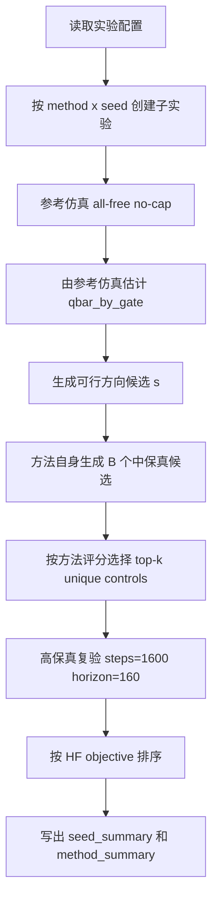
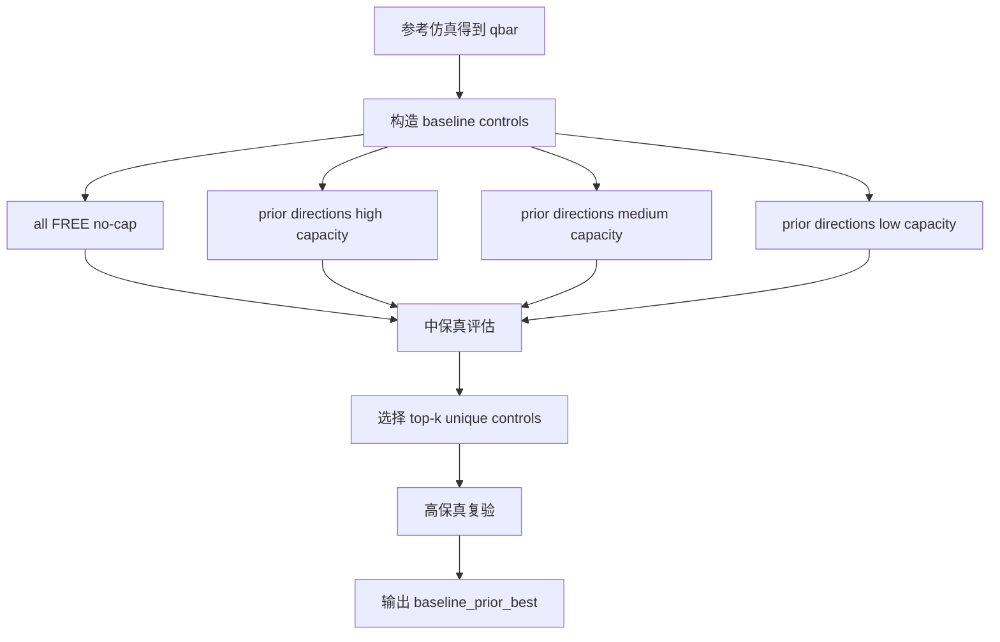
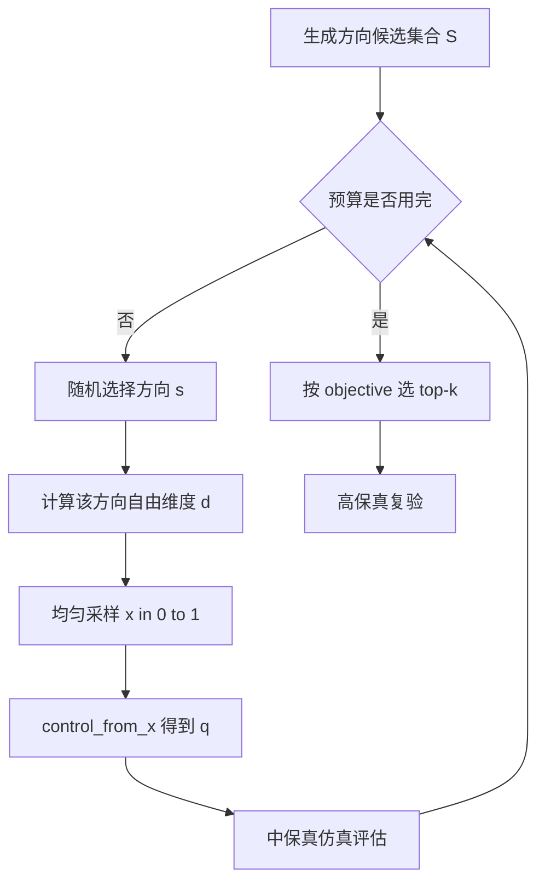
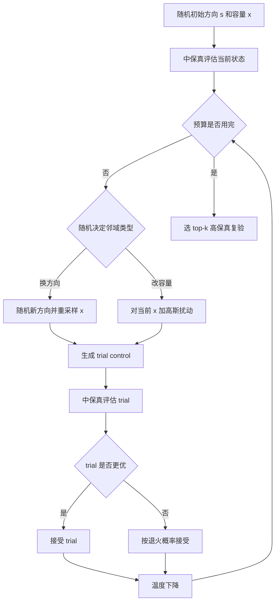
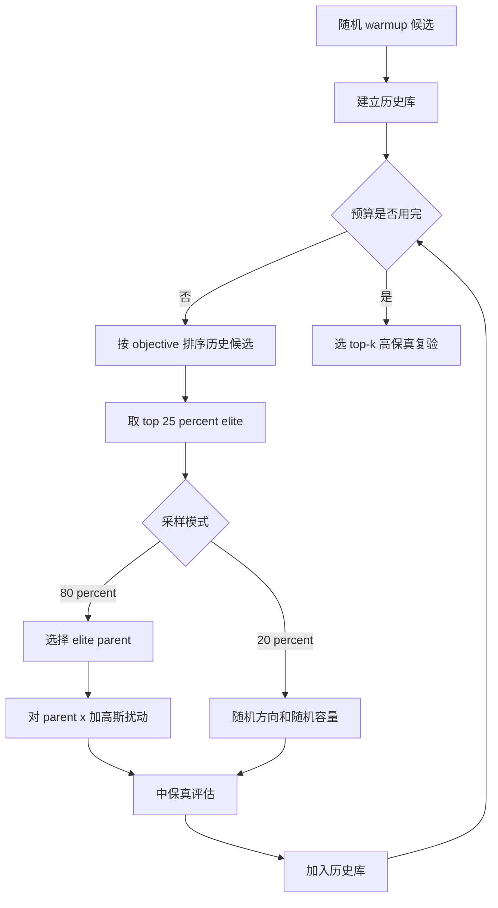
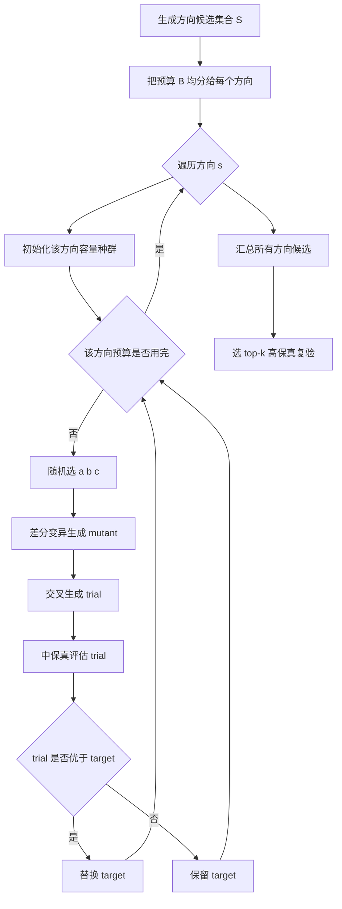
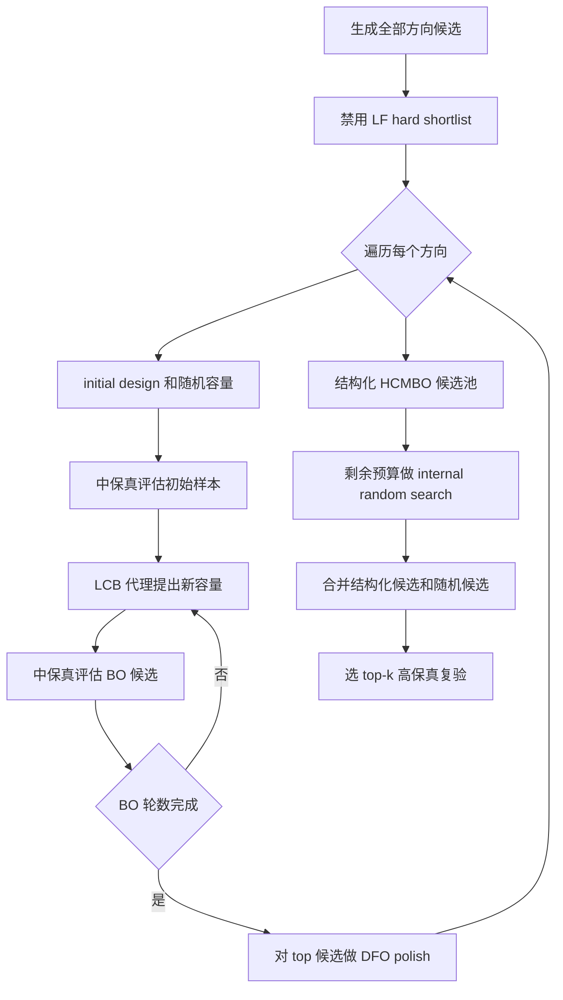
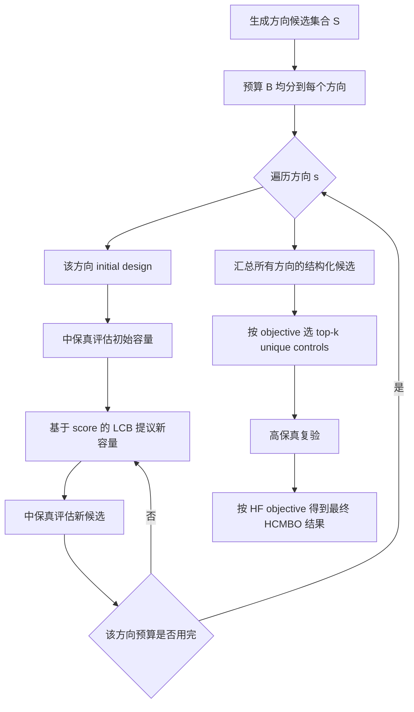
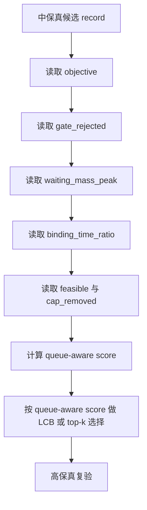
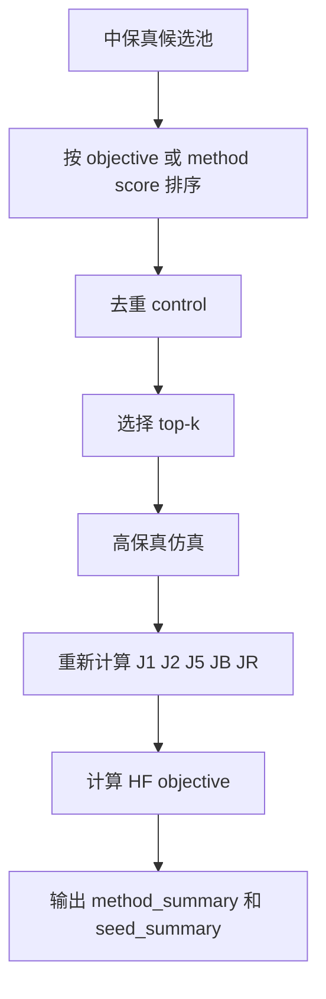

# 横向对比实验优化方法原理与实现

本文档说明当前 G6、G7-C、G7-D 横向对比实验中各优化方法的原理、代码实现步骤和高保真复验流程。实验统一优化混合变量：

```text
z = (s, q)
```

其中 `s` 是四条通道的方向配置，`q(t)` 是各通道入口的分段容量控制。代码中通常先采样归一化连续变量 `x`，再通过 `control_from_x()` 映射为满足方向--容量一致性的实际控制量 `q=T_s(x)`。

---

## 1. 通用实验流程

G6、G7-C、G7-D 的每个方法都遵循相同的外层评估逻辑：先用中保真优化阶段生成候选，再选出 top-k 进行高保真复验，最终只使用高保真结果排序。



文字说明：

1. 参考仿真用于估计每个入口的自然通行能力上限 `qbar_by_gate`。
2. 所有优化方法使用同一批方向候选生成规则和同一个 `control_from_x()` 方向--容量一致性映射。
3. `B=400` 是主要横向对比实验中的优化预算；`HF top_k=10` 是最终高保真复验候选数。
4. 中保真排序只用于选候选，最终结论以高保真 `best HF objective` 为准。

---

## 2. 方法总览

| 实验 | 方法名 | 代码入口 | 核心思想 |
|---|---|---|---|
| G6 | `baseline_prior_best` | `run_baseline_prior_best()` | 不搜索，只比较 no-cap 与先验容量方案 |
| G6 | `random_search` | `run_g6_random_search()` | 随机采样方向和容量 |
| G6 | `pure_sa` | `run_pure_sa()` | 对方向和容量做模拟退火 |
| G6/G7-C | `tpe_mixed_bo` | `run_tpe_mixed_bo()` | 本地 TPE-style elite 采样 |
| G6 | `enum_de` | `run_enum_de()` | 枚举方向，每个方向内用差分进化优化容量 |
| G6 | `hcmbo_proposed` | `run_hcmbo_proposed()` | 旧 HCMBO，结构化搜索 + internal random search |
| G7-C | `hcmbo_structured_only` | `run_hcmbo_structured_only()` | 全预算用于方向内结构化 LCB 搜索 |
| G7-C | `hcmbo_queue_aware_lcb` | `run_hcmbo_queue_aware_lcb()` | 旧预算结构，但候选按 queue-aware score 排序 |
| G7-C | `hcmbo_structured_queue_aware` | `run_hcmbo_structured_queue_aware()` | 全预算结构化搜索，并使用 queue-aware score |
| G7-D | `hcmbo` | `run_hcmbo_mainline()` | 最终 HCMBO 主干，即 structured-only 版本 |

---

## 3. Baseline Prior Best

### 原理

`baseline_prior_best` 不是优化算法，而是先验策略基线。它评估固定策略，包括无容量限制方案和先验方向下的 high、medium、low 容量方案，然后从这些候选中选出高保真结果最好的一个。



### 实现步骤

1. 调用 `evaluate_reference()` 得到参考结果和 `qbar_by_gate`。
2. 调用 `evaluate_baselines()` 生成固定 baseline 候选。
3. 用中保真评估这些候选。
4. 选择 top-k 不重复控制量进入高保真复验。
5. 输出该方法的最优高保真候选。

---

## 4. Random Search

### 原理

随机搜索直接在混合变量空间中均匀采样。每次先随机选择一个方向配置 `s`，再在该方向对应的自由容量维度中采样 `x ~ U(0,1)`，最后映射成实际容量控制 `q=T_s(x)`。



### 实现步骤

1. `generate_direction_candidates()` 生成方向候选。
2. 循环 `random_search_evaluations` 次。
3. 每次随机抽取一个方向，再随机采样容量参数 `x`。
4. 通过 `control_from_x()` 得到实际控制量。
5. 调用 `G5EvaluationCache.evaluate()` 做中保真评估。
6. 按中保真 objective 选 top-k unique controls 做高保真复验。

---

## 5. Pure Simulated Annealing

### 原理

纯模拟退火把方向和容量放在同一个状态中搜索。它从一个随机状态开始，每一步产生邻域候选：有一定概率更换方向并重采样容量，否则在当前容量向量附近做高斯扰动。更优候选直接接受，更差候选按退火概率接受。



### 实现步骤

1. 随机选择初始方向和容量向量。
2. 初始温度设为 `max(0.05, abs(objective) * 0.15)`。
3. 每步以约 `0.35` 概率更换方向，否则扰动当前容量。
4. 扰动尺度随预算消耗逐渐减小。
5. 若候选更优则接受；若更差，则按退火概率接受。
6. 所有访问过的候选都保留，用于最后 top-k 高保真复验。

---

## 6. TPE-Mixed BO

### 原理

当前 `tpe_mixed_bo` 是本地实现的 TPE-style 混合变量 BO，不是官方 Optuna TPE。它先随机 warmup，然后把历史候选按目标值排序，取前 25% 作为 elite。后续 80% 的新候选围绕 elite 扰动，20% 继续全局随机探索。



### 实现步骤

1. 先做若干随机 warmup，形成初始历史库。
2. 每轮将历史候选按 objective 从小到大排序。
3. 取前 25% 作为 elite 集合。
4. 以 80% 概率选择 elite parent，并对其容量向量加高斯扰动。
5. 以 20% 概率重新随机选择方向和容量。
6. 扰动尺度随迭代逐渐减小。
7. 最后按中保真 objective 选 top-k 进入高保真复验。

### 注意事项

该方法在当前实验中是很强的通用黑箱基线，但它是 dependency-light 的本地 TPE-style 实现。若论文需要更强外部基线，后续可以补官方 Optuna TPE 或 SMAC。

---

## 7. Enum-DE

### 原理

`enum_de` 把混合变量问题拆成两层：外层枚举方向，内层对固定方向下的连续容量参数做差分进化。它不在方向之间学习代理，而是把总预算平均分给所有方向。



### 实现步骤

1. 生成方向候选集合。
2. 将 `B=400` 按方向数量平均分配。
3. 对每个方向初始化连续容量种群，种群大小约为 `min(max(4, 2*dim), budget)`。
4. 使用差分变异 `a + 0.65*(b-c)`。
5. 使用交叉概率约 `0.7` 生成 trial。
6. 若 trial objective 更低，则替换 target。
7. 所有方向的候选合并后选 top-k 做高保真复验。

---

## 8. G6 HCMBO Proposed

### 原理

G6 的 `hcmbo_proposed` 是旧 HCMBO。它已经禁用了 LF hard shortlist，即保留全部方向候选；但它仍然包含 internal random search。预算结构大致为：

```text
方向内结构化搜索约 300 次
internal random search 约 100 次
总预算 400 次
```



### 实现步骤

1. 设置 `shortlist_size = direction_candidate_limit`，保留全部方向。
2. 对每个方向调用 `optimize_fixed_direction()`。
3. 固定方向内先做 `initial_design()`，包括 0.9、0.6、0.3 和随机容量。
4. 使用简化 LCB acquisition 提出新容量候选：
   - 用历史样本的距离加权均值估计目标；
   - 用到已有样本的最小距离表示不确定性；
   - acquisition 形式为 `mean - kappa * std * uncertainty`。
5. 对当前方向的若干 top 候选做 DFO 局部精修。
6. 用剩余预算做 internal random search。
7. 合并全部候选后选 top-k 做高保真复验。

### 本周结论

旧 HCMBO 的问题是 internal random search 会稀释结构化搜索预算，也会造成结果归因不清。因此后续主干改为 structured-only HCMBO。

---

## 9. Final HCMBO / Structured-Only HCMBO

### 原理

最终 HCMBO 主干对应 G7-D 中的 `hcmbo`，来源于 G7-B/G7-C 中表现最好的 `hcmbo_structured_only`。它取消 internal random search，把全部预算用于方向内结构化容量搜索。



### 实现步骤

1. 生成方向候选集合。
2. 将总预算 `B=400` 分配到各方向。
3. 对每个方向运行 `run_lcb_for_direction()`。
4. 每个方向先做初始设计，再循环用 LCB 提出容量候选。
5. 全部候选按 objective 排序，选 top-k 不重复控制量。
6. 高保真复验后输出最终结果。

### 与 G6 旧 HCMBO 的区别

| 项目 | G6 旧 HCMBO | G7-D 最终 HCMBO |
|---|---|---|
| LF hard shortlist | 禁用 | 禁用 |
| internal random search | 保留 | 取消 |
| 预算使用 | 结构化搜索 + 随机补预算 | 全部用于结构化搜索 |
| 结果归因 | 可能混入随机候选 | 候选均来自结构化搜索 |
| 论文名称 | 早期 HCMBO | HCMBO 主干 |

---

## 10. Queue-Aware HCMBO 变体

### 原理

queue-aware 变体不只看 objective，还把入口拒绝、等待峰值、容量绑定比例和不可行惩罚加入候选评分。它的目的不是单纯追求最低默认 objective，而是让搜索更关注入口排队和管理可执行性。



评分形式为：

```text
score = objective
      + 0.0001 * gate_rejected
      + 0.005  * waiting_mass_peak
      + 0.5    * binding_time_ratio
      + cap_removed penalty
      + infeasible penalty
```

### G7-C 中的两个 queue-aware 方法

| 方法 | 预算结构 | 候选排序 |
|---|---|---|
| `hcmbo_queue_aware_lcb` | 约 300 次结构化搜索 + 100 次 internal random | queue-aware score |
| `hcmbo_structured_queue_aware` | 400 次全部结构化搜索 | queue-aware score |

### 实验解释

queue-aware 方法通常能降低 `gate_rejected`，但默认综合目标不一定最低。这说明它适合作为约束感知 acquisition 或二级评价目标，而不是直接替代默认 objective。

---

## 11. 高保真复验与结果输出

所有横向方法最终都回到同一个高保真复验流程：



注意：

1. G6 的 random、SA、TPE、DE、旧 HCMBO 默认按 objective 选 top-k。
2. G7-C 的 queue-aware 方法按 queue-aware score 选 top-k。
3. 最终表格仍以高保真 objective 作为主要排序依据。

---

## 12. 方法对比的论文解释口径

当前实验结果建议采用以下解释口径：

1. `baseline_prior_best` 用于说明人工先验和无容量控制不足。
2. `random_search` 是最基本的混合变量黑箱基线。
3. `pure_sa` 检验简单启发式局部搜索能力。
4. `enum_de` 检验“枚举方向 + 连续优化容量”的分解式基线。
5. `tpe_mixed_bo` 是当前最强的通用 mixed-variable 黑箱基线。
6. G6 旧 HCMBO 说明方向--容量分层有价值，但 internal random search 和预算分配仍有问题。
7. G7-D 最终 HCMBO 说明取消 internal random search、集中预算到结构化方向内容量搜索后，方法在多 seed 平均结果上超过当前 TPE-style 基线。
8. queue-aware HCMBO 说明入口排队指标可以改变搜索偏好，是后续提升管理可执行性的重点方向。
