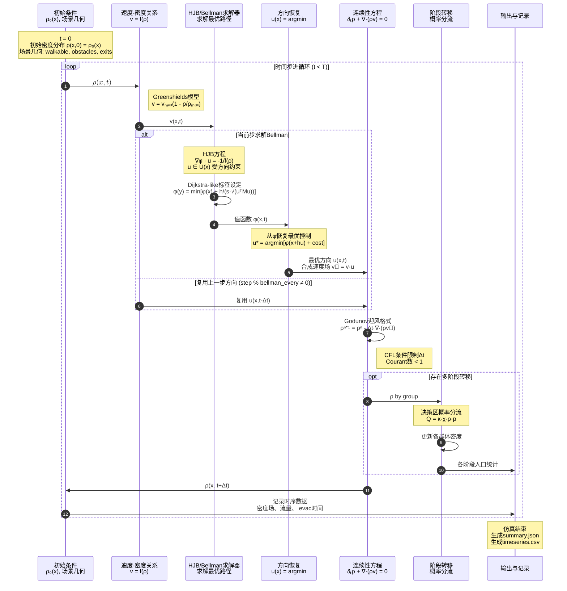
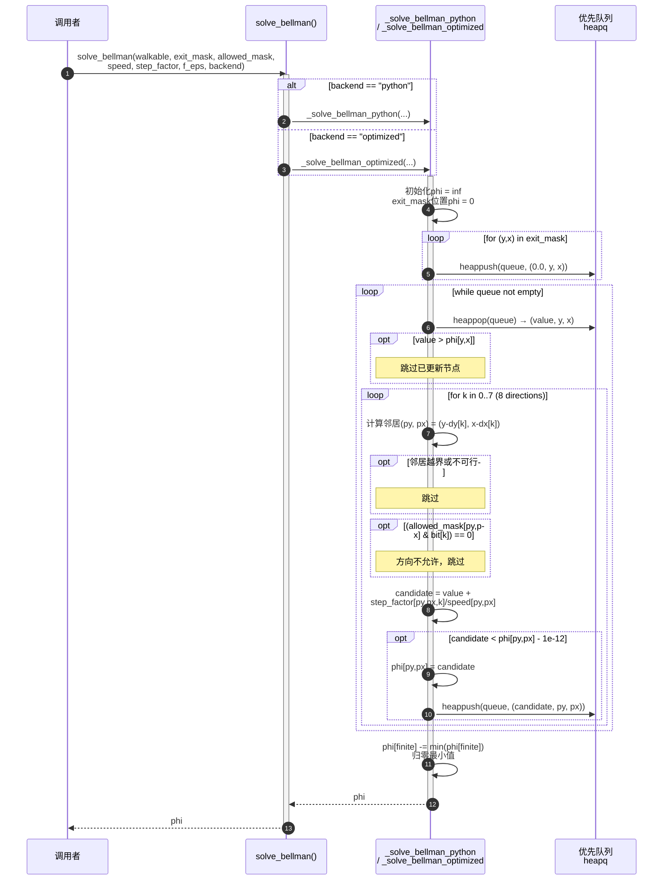
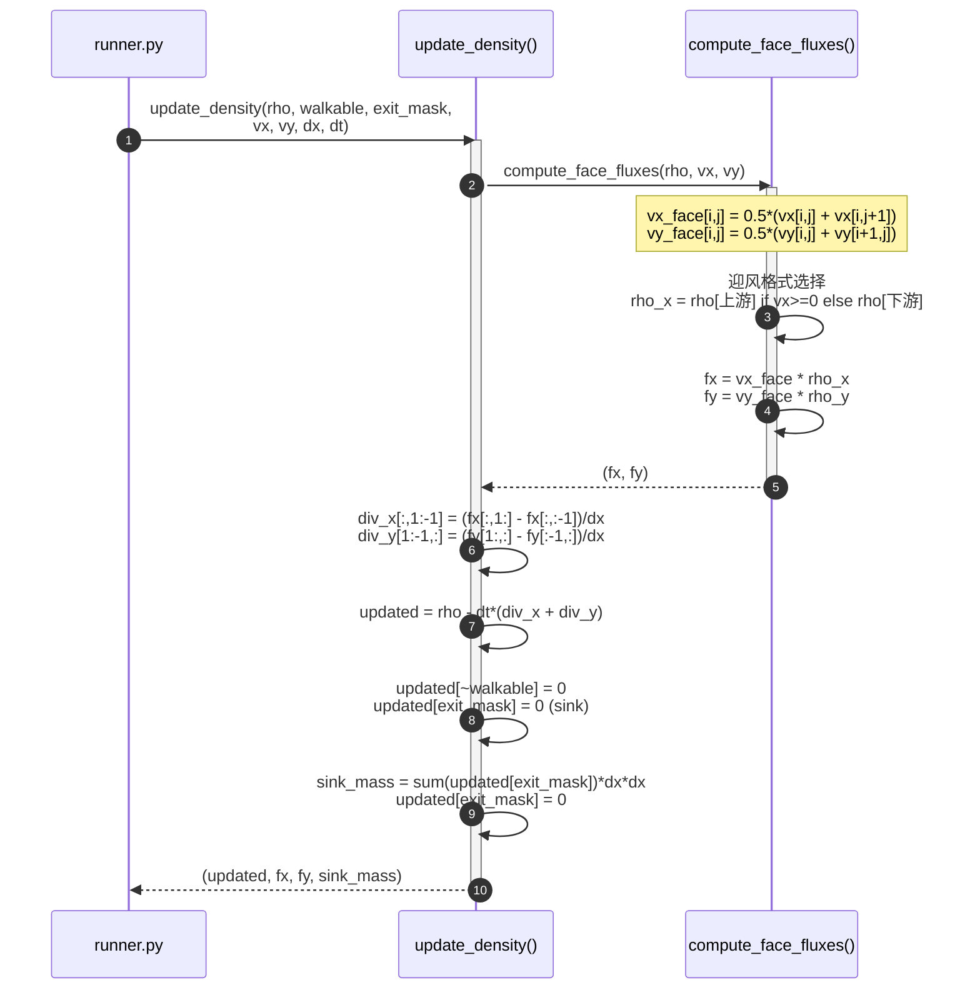
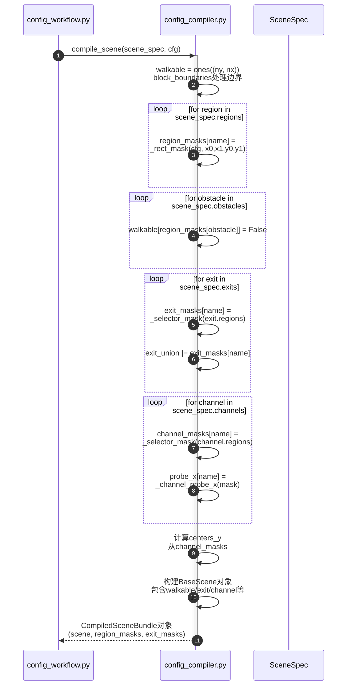
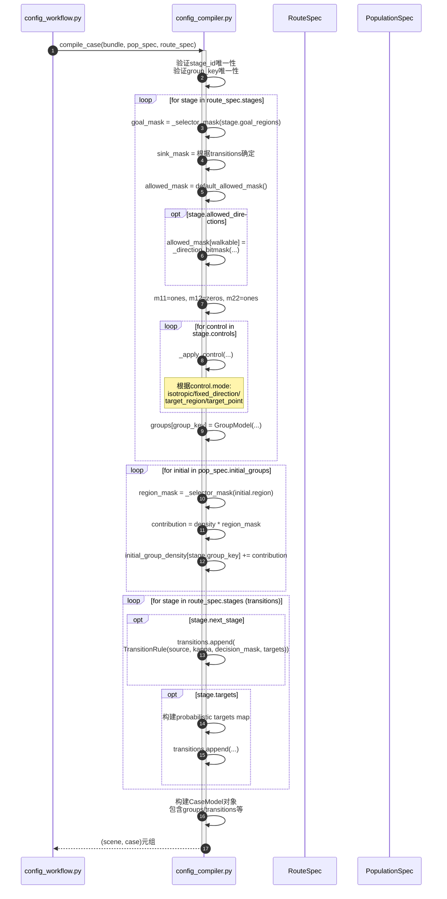

# 宏观模型运行原理时序图

## 1. 宏观模型数学原理时序图

此图展示Hughes连续模型与各向异性引导相结合的数学原理。



---

## 2. 代码模块运行流程时序图

此图展示从配置到结果生成的完整软件执行流程。

```mermaid
sequenceDiagram
    autonumber

    actor User as 用户
    participant CLI as simulate_from_config.py<br/>CLI入口
    participant Loader as loaders/<br/>config_loader.py
    participant Compiler as compilers/<br/>config_compiler.py
    participant Runner as runner.py<br/>simulate_case()
    participant Core as core.py<br/>数值内核
    participant Metrics as metrics.py<br/>统计记录
    participant Plotting as plotting.py<br/>可视化

    %% ========== 配置加载阶段 ==========
    User->>CLI: python simulate_from_config.py<br/>--config scenes/example/run.toml
    activate CLI

    CLI->>Loader: load_run_config(run.toml)
    activate Loader
    Loader-->>CLI: RunSpec (simulation, paths, objective)
    deactivate Loader

    CLI->>Loader: load_scene_spec(scene_path)
    activate Loader
    Loader-->>CLI: SceneSpec (regions, obstacles, exits)
    deactivate Loader

    CLI->>Loader: load_population_spec(pop_path)
    activate Loader
    Loader-->>CLI: PopulationSpec (initial_groups)
    deactivate Loader

    CLI->>Loader: load_route_spec(routes_path)
    activate Loader
    Loader-->>CLI: RouteSpec (case_id, stages, controls)
    deactivate Loader

    %% ========== 编译阶段 ==========
    CLI->>Compiler: compile_scene(scene_spec, cfg)
    activate Compiler
    Note over Compiler: 构建walkable掩码<br/>处理obstacles<br/>生成exit_masks<br/>生成channel_masks
    Compiler-->>CLI: CompiledSceneBundle<br/>(scene, region_masks, exit_masks)
    deactivate Compiler

    CLI->>Compiler: compile_case(bundle, pop_spec, route_spec)
    activate Compiler
    Note over Compiler: 为每stage创建GroupModel<br/>编译control策略→m11/m12/m22<br/>构建allowed_mask<br/>处理transitions
    Compiler-->>CLI: (BaseScene, CaseModel)
    deactivate Compiler

    %% ========== 仿真初始化 ==========
    CLI->>Runner: simulate_case(cfg, scene, case, ...)
    activate Runner

    Runner->>Runner: _build_group_models(case)
    Note right of Runner: 提取groups字典<br/>或创建legacy单群体

    Runner->>Runner: _build_initial_group_density(...)
    Note right of Runner: 根据population_spec<br/>初始化rho_by_group

    Runner->>Core: precompute_step_factors(...)
    activate Core
    Core-->>Runner: step_factors (per group)
    deactivate Core

    Runner->>Core: build_transition_out_rate_maps(...)
    activate Core
    Core-->>Runner: transition_rates
    deactivate Core

    Runner->>Metrics: init_case_stats(channel_masks)
    activate Metrics
    Metrics-->>Runner: stats容器
    deactivate Metrics

    %% ========== 主仿真循环 ==========
    loop while step < steps && time < horizon
        Runner->>Core: compute_total_density(rho_by_group)
        activate Core
        Core-->>Runner: rho_tot
        deactivate Core

        Runner->>Core: greenshields_speed(rho_tot, vmax, rho_max)
        activate Core
        Core-->>Runner: speed field
        deactivate Core

        opt step % bellman_every == 0
            loop for each group
                Runner->>Core: solve_bellman(...)
                activate Core
                Note over Core: 优先队列Dijkstra<br/>8方向扩展
                Core-->>Runner: phi (值函数)
                deactivate Core

                Runner->>Core: recover_optimal_direction(...)
                activate Core
                Note over Core: 从phi恢复最优u
                Core-->>Runner: (ux, uy)
                deactivate Core
            end
        end

        Runner->>Runner: compute velocity<br/>vx = speed * ux, vy = speed * uy

        Runner->>Core: compute_cfl_dt_multigroup(...)
        activate Core
        Core-->>Runner: dt
        deactivate Core

        loop for each group
            Runner->>Core: update_density(rho, vx, vy, dt)
            activate Core
            Note over Core: 迎风格式<br/>计算face fluxes<br/>更新密度
            Core-->>Runner: (rho_next, fx, fy, sink_mass)
            deactivate Core
        end

        opt 存在transitions
            Runner->>Core: apply_fixed_probability_splitting(...)
            activate Core
            Note over Core: 决策区概率分流<br/>更新rho_by_group
            Core-->>Runner: updated rho_by_group
            deactivate Core
        end

        Runner->>Metrics: record_step(stats, ...)
        activate Metrics
        Note over Metrics: 记录密度、流量<br/>通道统计、 evac进度
        deactivate Metrics

        opt step % save_every == 0
            Runner->>Plotting: save_case_snapshot(...)
            activate Plotting
            Note over Plotting: matplotlib生成<br/>密度场+方向场
            Plotting-->>Runner: snapshot_*.png
            deactivate Plotting
        end
    end

    %% ========== 输出阶段 ==========
    Runner->>Metrics: save_case_timeseries(path, stats)
    activate Metrics
    Metrics-->>Runner: timeseries.csv
    deactivate Metrics

    Runner->>Plotting: save_timeseries_plot(...)
    activate Plotting
    Plotting-->>Runner: timeseries.png
    deactivate Plotting

    Runner->>Metrics: build_summary(case_id, stats, ...)
    activate Metrics
    Note over Metrics: 计算J1,J2,J5<br/>总 evac时间<br/>拥堵暴露
    Metrics-->>Runner: summary dict
    deactivate Metrics

    Runner->>Metrics: save_json(summary.json, summary)
    activate Metrics
    Metrics-->>Runner: 文件写入完成
    deactivate Metrics

    Runner-->>CLI: summary
    deactivate Runner

    CLI->>CLI: _write_config_snapshot(...)
    Note over CLI: 复制原始TOML<br/>生成manifest.json

    CLI-->>User: 完成提示<br/>输出目录路径
    deactivate CLI
```



---

## 3. 核心算法详细时序图

### 3.1 Bellman求解器内部流程



### 3.2 密度更新详细流程



---

## 4. 配置编译详细时序图

### 4.1 场景编译流程



### 4.2 案例编译流程



---

## 5. 图例说明

### 时序图符号约定

| 符号 | 含义 |
|------|------|
| `->>` | 同步调用/请求 |
| `-->>` | 返回结果 |
| `activate`/`deactivate` | 对象生命周期 |
| `loop` | 循环执行 |
| `opt` | 可选执行（条件分支） |
| `alt`/`else` | 互斥条件分支 |
| `Note over` | 注释说明 |
| `participant` | 参与对象 |

### 模块颜色约定

```text
%% 在支持CSS的渲染器中，可使用以下颜色编码：
%% Loader层: #E1F5FE (浅蓝)
%% Compiler层: #E8F5E9 (浅绿)
%% Simulation层: #FFF3E0 (浅橙)
%% Core层: #F3E5F5 (浅紫)
%% Metrics/IO: #ECEFF1 (灰)
```

---

## 6. 参考文件

- 完整架构文档: `codes/doc/代码架构.md`
- 配置字段参考: `codes/scenes/README.md`
- 理论模型文档: `methodology/model.md`
