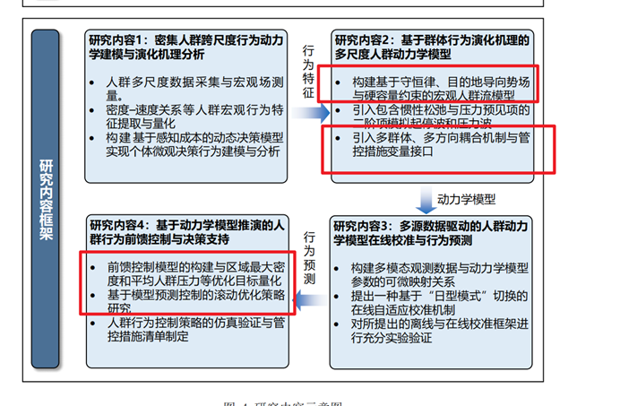

# 面向大客流治理区域的宏观人群动力学模型与管控措施优化
## 研究内容概述
本部分属于大论文开题的研究内容2和研究内容4的部分内容

对应大论文章节：第4章和第5章

主要内容为：宏观的人群动力学模型中的管控措施模型与管控措施的优化设计

### 基础模型框架
基于 Hughes 连续人群模型出发，采用连续介质力学的观点，建立密度-速度耦合的偏微分方程系统：
$$\frac{\partial \rho}{\partial t} + \nabla \cdot (\rho \mathbf{v}) = 0$$
其中速度由势函数和速度-密度关系确定：$\mathbf{v} = f(\rho) \frac{-\nabla \phi}{|\nabla \phi|}$，满足不可压约束 $|\nabla \phi| = \frac{1}{f(\rho)}$

### 场景定义：多管控通道的大街区场景
- 几何：矩形区域内有一道隔墙，上下左右四周围壁，隔墙设3条通道（上/中/下）
- 人流来源：左侧边界均匀涌入（spawn region）
- 疏散目标：右侧边界（target region）
- 管控区域：3条通道及其周边

### 管控措施的两个维度

#### 1. 通道方向控制（Direction Control）
- **变量定义**：为中间通道引入"禁止正向通行"的约束，人群只能经过上/下通道或反向通过中通道
- **模型体现**：通过 Hamilton–Jacobi–Bellman (HJB) 控制集 $U(x)$ 对行走方向进行约束
  $$\max_{\mathbf{u} \in U(x)} \{-f(\rho) \mathbf{u} \cdot \nabla \phi\} = 1$$
  其中 $U(x)$ 在中通道内限制为 $\{\mathbf{u}: \text{不含}+x\text{分量}\}$

#### 2. 通道几何引导（Geometric Guidance via Metric Tensor）
- **变量定义**：通过各向异性度量张量 $\mathbf{M}(x)$ 改变通道内的空间"代价"，增大横向代价促使人群沿通道纵向流动
- **模型体现**：改造 eikonal 方程的等方性假设
  $$\sqrt{\nabla \phi^{\top} \mathbf{M}(x) \nabla \phi} = \frac{1}{f(\rho)}$$
  构造对角矩阵 $\mathbf{M}(x) = \text{diag}(M_{11}, M_{22})$，通道内令 $M_{22} \ll M_{11}$ 提高纵向"通行代价"

### 控制目标

#### 主目标
- 指定区域（通道及其下游）内的人群密度 $\rho$ 保持在合理水平（避免踩踏）
- 指定区域内的人群流速 $v$ 维持在目标范围（既要高效疏散，又要安全预留）

#### 辅助指标
- 总疏散时间（evacuation time）
- 通道利用率分布（上/中/下通道的累计通过人数占比）
- 拥堵峰值（peak density）与缓解时间
- 流率稳定性（flow rate variance）

### 预期理论成果

1. **管控量化框架**
   - 将"通道方向控制"和"几何引导"两种措施以一致的数学框架（修正 Hughes 模型）表示
   - 推导两种措施对势函数、速度场和密度演化的影响机制

2. **离散数值求解方案**
   - 各向异性 eikonal 方程的 Godunov 有限差分求解法
   - 离散 HJB 值迭代算法及其收敛性分析
   - CFL 稳定性条件的改进

3. **通道特性耦合理论**
   - 控制方向约束与几何引导的独立性和耦合效应分析
   - 通道参数（宽度、位置、方向限制强度）对流场的敏感性

### 实验方案

#### 仿真流程（How to simulate）
1. **几何构建**：标准化的矩形区域网格化（100×70 单元），设定可行域 walkable、生成源区 spawn_mask、汇区 target_mask
2. **初期化**：初始密度 $\rho_0 \sim 0.8 \,\text{ped/m}^2$ 均匀分布于源区
3. **动态更新循环**（每时间步）：
   - 根据当前密度 $\rho$ 计算速度函数 $f(\rho)$
   - 求解势函数 $\phi$（eikonal 或 HJB）
   - 计算方向场 $\mathbf{u}^*$ 和速度场 $\mathbf{v} = f(\rho) \mathbf{u}^*$
   - 迎风格式更新密度 $\partial_t \rho + \nabla \cdot (\rho \mathbf{v}) = 0$
   - 边界处理（源区补充、汇区移除）
4. **输出**：每 1 步保存一帧密度场彩图 + 速度矢量图（共 200 步）

#### 对比验证（How to validate）
- **基线方案（Method 1）**：标准 Hughes 模型 + 动态势场 + 对中通道的简单方向限制
  产物：`codes/results/scene1/` [已有 400 个产物，对应 A/B 两 case × 200 步]

- **几何引导方案（Method 2）**：Hughes 模型 + 各向异性 eikonal（M 张量）+ 上下通道几何引导，中通道开放
  产物：`codes/results/scene1_metricA/` [已有 200 个产物]

- **双控策略方案（Method 3）**：Hughes 模型 + M 张量 + HJB 离散控制约束（中通道禁 +x）
  产物：`codes/results/scene1_M_plus_HJB/` [已有 200 个产物]

#### 定量对比指标
1. **疏散效率**：
   - 总疏散时间 $T_{\text{evac}}$（最后一个人离开网格的时刻）
   - 平均通过时间 $\bar{T}_{\text{transit}}$

2. **密度分布**：
   - 全域平均密度 $\bar{\rho}(t)$、峰值密度 $\rho_{\max}(t)$
   - 通道区域密度统计（上/中/下的时均密度）

3. **流量**：
   - 汇区累计通过人数曲线
   - 各通道的通过人数及占比

4. **稳定性**：
   - 速度场的间断度（方向变化频率）
   - 密度的梯度强度（可用作"质量"指标）

### 仿真数据设计

#### 网格与参数标准化
| 参数 | 值 | 说明 |
|------|-----|------|
| 网格大小 | 100×70 | 模拟街区约 100 m × 70 m |
| 格点间距 | 1.0 m | 空间分辨率 |
| 时间步 | 0.5~5.0 s | 根据方案调整（CFL 条件控制） |
| 总步数 | 200 | 仿真时长 100~1000 s |
| 最大速度 $v_{\max}$ | 10.0 m/s | 人行走最大速度（实际值 ~1.4 m/s，但为快速演化可调） |
| 最大密度 $\rho_{\max}$ | 1.0 ped/m² | 假设总可通行面积为约 6000 m²，最大容纳 6000 人 |

#### 场景初值
- 初始密度在 spawn 区：$\rho_0 = 0.8 \,\text{ped/m}^2$
- 稳定供应（可选）：每步在 spawn 边界补充新人流（模拟进场）
- Hughes 速度-密度曲线：Greenshields 模型 $f(\rho) = v_{\max}(1 - \rho/\rho_{\max})$

#### 管控参数变化表
| 方案 | 中通道方向 | M 张量各向异性 | 说明 |
|------|----------|-----------|------|
| Method 1-A | 全向 | 无（$M=I$） | 基线，无约束 |
| Method 1-B | 禁 +x | 无（$M=I$） | 粗粒度方向限制 |
| Method 2 | 全向 | $M_{22}^{\text{in}}=1/25$ | 仅几何引导，上下通道 |
| Method 3 | 禁 +x | $M_{22}^{\text{in}}=1/25$ | 双控策略 |

### 真实数据来源与验证（Future）

#### 实地调查可能的数据来源
1. **人流动态**：
   - 摄像头数据+LBS数据+腾讯小网格数据 ✅️

2. **几何信息**：
   - 自建简化模型（基于实际建筑平面图抽象） ✅️

3. **参数标定**：
   - 人群密度与舒适度关联（ 视频分析）
   - 拥堵对速度的影响函数（拟合 $f(\rho)$ 参数）

#### 数据融合策略（第二阶段）
- 用实地数据参数化 Hughes 模型的系数 $v_{\max}, \rho_{\max}$ 等
- 用实际通道尺寸/限制条件调整 $\mathbf{M}(x), U(x)$ 的定义
- 做模型-真实数据对标（validation）

## 预期成果

### 大论文第四章和第五章对应章节

#### 第四章：管控措施的连续模型与数值求解
1. **Hughes 模型的两种管控拓展**
   - 小节 4.1：基于度量张量的几何引导框架（eikonal 推广、方向修正、速度场耦合）
   - 小节 4.2：基于 HJB 的离散控制约束框架（控制集定义、值迭代算法、收敛性分析）

2. **数值求解算法**
   - 小节 4.3：各向异性 eikonal 的 Godunov 有限差分格式及稳定性条件
   - 小节 4.4：离散 HJB 的迭代求解、方向选择算法、CFL 条件改进

3. **实现与验证**
   - 小节 4.5：三种方案的在参考场景上的实现细节与数值对比

#### 第五章：管控措施效果评估与优化初步
1. **三方案的定量对比**
   - 小节 5.1：基线方案、几何引导、双控策略的疏散效率、密度分布、流量特性对比分析
   - 小节 5.2：通道利用率、拥堵峰值、稳定性等辅助指标的敏感性分析

2. **管控参数的优化方向**
   - 小节 5.3：M 张量参数（$M_{22}$ 强度）对流场的影响
   - 小节 5.4：通道方向限制的强度选择（完全禁止 vs. 减弱优先）与疏散效果的权衡

3. **工程应用启示**
   - 小节 5.5：基于模型输出的实际管控策略建议、无人值守场景的自主决策框架初步

### 1篇小论文

#### 论文主题
**"基于控制约束和几何引导的连续人群模型：在多通道疏散场景中的应用"**
*Crowd Management and Control with Directional and Anisotropic Guidance: A Continuous Model Approach*

#### 核心贡献
1. 统一的数学框架，将通道方向限制和几何各向异性引导纳入 Hughes 微观模型
2. 两种管控手段的独立效果与耦合效应的定量分析
3. 多通道实际场景的仿真对比与工程参数指导

#### 候选期刊（优先级排序）
1. **Transportation Research Part C: Emerging Technologies**
   匹配度：高
   理由：聚焦人群疏散、管控策略优化，偏应用导向
   目标 Impact Factor：> 5.0
   稿件体量：12~15 页（双栏）

2. **Transportation Research Part B: Methodological**
   匹配度：高
   理由：强调数学建模与数值方法，学术严谨度高
   目标 Impact Factor：> 4.5
   稿件体量：15~18 页（双栏）

3. **IEEE Transactions on Intelligent Transportation Systems**
   匹配度：中高
   理由：框架涉及数值控制、优化，偏系统论文
   目标 Impact Factor：> 5.5
   稿件体量：12~16 页（双栏）

#### 预计稿件结构与篇幅分配
| 章节 | 内容 | 页数 |
|------|------|------|
| 1. Introduction | 人群疏散问题、管控策略现状、论文贡献 | 2~2.5 |
| 2. Model Formulation | Hughes 基础、M 张量改造、HJB 控制集 | 3~3.5 |
| 3. Numerical Methods | eikonal 求解、HJB 值迭代、CFL 稳定性 | 3~3.5 |
| 4. Experimental Setup | 场景设计、参数表、三方案对比设置 | 1.5~2 |
| 5. Results & Comparison | 仿真结果、定量对比、敏感性分析 | 4~4.5 |
| 6. Discussion | 物理意义、工程启示、局限与后续工作 | 2~2.5 |
| References | 参考文献与附录 | 1~1.5 |
| **总计** | | **17~20 页** |

#### 一个发明专利

##### 专利名称
**"基于动态势函数与控制约束的人群管控系统"**
*A Crowd Management and Control System Based on Dynamic Potential Functions and Directional Control*

##### 主要发明点
1. **核心装置**：
   - 人群密度与流速的实时监测模块（传感器/摄像头输入）
   - 基于修正 Hughes 模型的在线势场计算引擎
   - 针对多通道场景的管控指令生成模块（可调通行方向限制与流速指导）

2. **算法创新**：
   - 耦合 M 张量和 HJB 控制集的离散求解算法
   - 快速通道识别与适应性参数调整机制
   - CFL 动态时步控制保证实时计算稳定性

3. **应用场景**：
   - 地铁站、机场、商业综合体的应急疏散自主管控
   - 动态标志系统（LED 指引、语音提示）的指令源
   - 物理隔离（可伸缩栏杆）的协调控制

##### 保护范围（独立权利要求示意）
1. 包含实时密度监测、势场在线计算、管控指令生成的完整系统
2. 通阈值化的通道方向限制策略
3. M 张量在线参数化与动态调整的方法
4. 多通道的并行控制与优先级协调机制

---

## 研究时间计划（可选补充）

| 阶段 | 时间 | 主要任务 | 产出 |
|------|------|--------|------|
| 1 前期 | 2026 Q1 | 理论框架完善、三方案代码化 | model.md、三个脚本、初步结果 |
| 2 实验 | 2026 Q2 | 系统对比实验、参数敏感性分析、指标统计 | 对标表、论文初稿数据 |
| 3 撰写 | 2026 Q2~Q3 | 小论文撰写、大论文章节整合 | 小论文投稿版、大论文 4-5 章稿 |
| 4 专利 | 2026 Q3 | 专利申报、技术方案完善 | 专利申报文件、发明说明书附图 |
| 5 改进 | 2026 Q3~Q4 | 审稿反馈处理、真实数据验证 | 终稿、实验数据补充 |

---

## 风险与应对

| 风险 | 发生概率 | 应对方案 |
|------|--------|--------|
| 离散 HJB 求解耗时过长，难以实时 | 中 | 预计算 + 在线插值；流量感应的自适应参数表 |
| 参数敏感性过高，实际鲁棒性低 | 中 | 增加场景多样性测试；加入随机扰动验证 |
| 专利审查过程冗长 | 低 | 提前启动申报；与学校专利办并行推进 |
