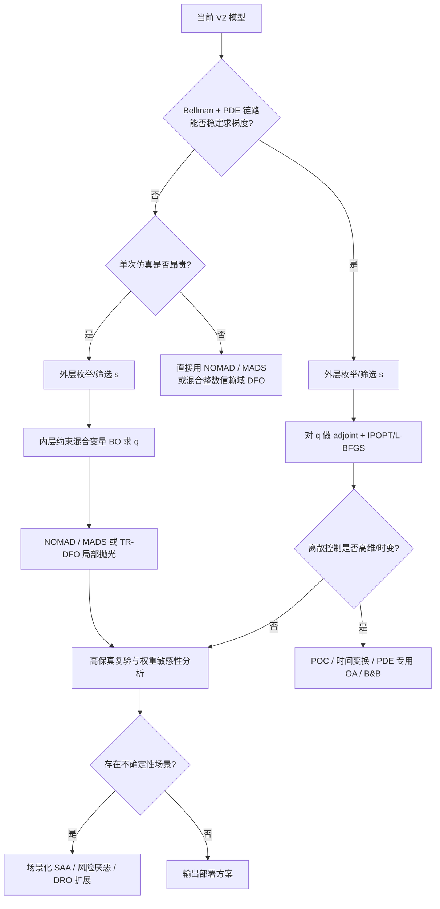

# 基于前沿与权威文献的 Bellman—守恒律人群管控优化建模与算法选择报告

## 执行摘要

你上传的 V2 模型已经足够明确地暴露出这个问题的数学本质：控制变量由离散的通道方向配置 $s$ 与分段常数的入口速率 $q$ 组成；状态由 Bellman 路径选择层与多群体守恒方程共同决定；内部入口的实际通量还要经过 $\min\{A_c^\pm,q_c^\pm\}$ 型容量裁剪；目标函数是效率、安全、负载均衡、入口等待和平滑性等多指标的加权和。换言之，这不是一个普通的连续优化问题，而是一个**混合离散—连续、动态、PDE 约束、并带显式非光滑结构**的优化问题。更具体地说，它在“数学分类”上最接近**混合整数 PDE 约束优化**，在“计算实现”上又非常接近**昂贵仿真驱动的混合变量黑盒优化**。fileciteturn0file0

基于近十年、尤其近五年的高质量文献，最稳妥的主结论是：**你当前这版问题，不应优先作为通用代数型 MINLP 直接交给 branch-and-bound / outer approximation 求解器；更推荐采用“分层混合求解”路线：先处理离散构型 $s$，再对连续速率 $q$ 做约束贝叶斯优化，最后用 NOMAD/MADS 或混合整数信赖域无导数方法做局部抛光。** 这样做的原因并不只是“好用”，而是与你模型的三个关键特征高度一致：一是 Bellman 层的 $\min/\arg\min$ 与安全指标中的指示函数导致问题天然非光滑；二是每次评估都要跑 Bellman–守恒律仿真，单点评估代价往往高；三是离散变量维度相对不大，而连续变量维度中等，正适合“离散外层 + 样本高效的连续内层”结构。MiVaBo、HyBO、CoCaBO、BO-FM 等混合变量贝叶斯优化文献都表明，这类方法对昂贵混合空间问题具有很强的样本效率；而 NOMAD / 混合整数信赖域 DFO 则在非光滑、黑盒、混合变量场景下给出更强的局部收敛与工程稳定性。citeturn6view0turn11view2turn6view2turn11view0turn16view0turn18view0

如果你未来能够把 Bellman 求解器、有限体积通量更新和目标函数全部改造成**可微且可稳定回传梯度**的链路，那么推荐路线会切换为：**枚举或筛选离散 $s$ 后，对连续 $q$ 使用 adjoint + IPOPT/L-BFGS 等 PDE 约束连续优化方法；若离散控制进一步变成时变开关，则考虑部分外凸化、时间变换、外逼近或 PDE 专用 branch-and-bound。** 这条路线在 PDE 约束优化与混合整数最优控制文献中是有成熟理论和算例支撑的，但它的前提是“可微模型访问”而不是“仿真黑盒访问”。citeturn13search3turn13search7turn35view0turn26search3turn34view0turn33view0

如果 $\hat p$、外部到达流、速度—密度函数参数、阶段转移概率等后续被建模为不确定量，那么当前的确定性问题应扩展为**场景化随机优化**或**分布鲁棒优化**。这时推荐算法不是完全推翻，而是在外层评价中引入场景平均、CVaR、chance constraints 或 DRO 风险度量，然后继续沿用“场景化 BO / DFO + 代理 + 并行评估”的框架。近年的 Acta Numerica 综述已经把“带不确定性的 PDE 约束优化”和“DRO”分别系统化了。citeturn37view0turn38view0

## 问题重构与检索策略

根据你上传的模型，可以把当前优化问题压缩写成下面的范式：

\[
\min_{s,q}\; J(s,q\mid \hat p)
=
\lambda_1\tilde J_1+\lambda_2\tilde J_2+\lambda_5\tilde J_5+\lambda_B\tilde J_B+\lambda_R\tilde J_R
\]

其中 $s_c\in\{+1,-1,0,\varnothing\}$，$q_c^\pm(t)$ 被分段常数参数化为 $q_{c,\ell}^\pm$，并满足方向—速率一致性约束与总容量约束；状态变量则通过 Bellman 势函数、最优方向 $u_g^*$、速度场 $v_g$、守恒方程和入口受控通量共同决定。你的文件还明确给出，当 $C=4$、$L=4$ 时，连续速率变量上限规模约为 $4\times 2\times 4=32$；而离散方向构型若完全展开，理论上是 $4^C$，在 $C=4$ 时只需检查至多 256 个静态构型。fileciteturn0file0

从这个结构出发，可以明确判断本题具有以下性质。首先，它是**混合变量问题**：$s$ 是离散决策，$q$ 是连续决策。其次，它是**动态约束问题**：目标评价依赖整段时间上的 PDE/守恒律演化。再次，它大概率是**非凸且非光滑**的：Bellman 方程中有 $\min$ 与 $\arg\min$，入口约束中有 $\min\{A,q\}$，安全项 $J_2$ 中有指示函数，负载均衡项本身也会因为通量裁剪和状态依赖而变得非线性。最后，在当前文件设定下，$\hat p$ 被固定为外生偏好参数，因此**当前版本更接近确定性优化**，而不是随机优化。fileciteturn0file0

据此，本次检索的核心关键词组合应围绕两条主线展开。第一条主线是“**PDE/最优控制结构**”，例如：`mixed-integer PDE-constrained optimization`、`MIPDECO`、`mixed-integer optimal control`、`combinatorial switching constraints`、`outer approximation PDE control`、`time-domain decomposition mixed-integer optimal control`、`crowd dynamics optimal control`、`Bellman conservation law crowd control`。第二条主线是“**仿真黑盒/混合变量算法**”，例如：`mixed-variable Bayesian optimization`、`expensive black-box mixed-integer optimization`、`derivative-free mixed-integer optimization`、`MADS mixed integer`、`trust-region derivative-free mixed-integer`、`constrained mixed-integer Bayesian optimization`、`simulation optimization mixed variables`。中文侧检索则建议使用“混合整数 PDE 约束优化”“仿真优化”“混合变量贝叶斯优化”“人群疏散优化”“Bellman-守恒律 人群管控”等关键词，以补充中文综述与应用背景。

本次筛选标准按“近十年、优先近五年、原始论文优先于二手解读、同行评审优先于预印本、顶刊/顶会/权威综述优先于一般期刊”执行。最终保留的核心来源主要来自 *Mathematical Programming*、*SIAM Journal on Optimization*、*SIAM Journal on Control and Optimization*、*INFORMS Journal on Computing*、*Acta Numerica*、*Computational Optimization and Applications*、*European Journal of Operational Research*、*Annual Review of Control, Robotics, and Autonomous Systems*，以及 ICML、UAI、IJCAI、NeurIPS 等会议论文与少量 Optimization Online / arXiv 补充材料。citeturn33view0turn6view8turn21view1turn6view9turn37view0turn16view0turn6view3turn21view0turn6view0turn11view0turn11view2turn12view0

## 相似问题类型与建模模板

从文献对照看，你的问题并不是只落在一个篮子里，而是同时踩中了两个最关键类别：**混合整数 PDE 约束优化**与**昂贵仿真驱动的混合变量黑盒优化**。前者解释了建模结构，后者解释了更合适的计算方法。citeturn33view0turn16view0turn6view0

| 问题类别 | 典型建模模板 | 是否最像你的问题 | 典型凸性/光滑性 | 梯度可得性 |
|---|---|---|---|---|
| 混合整数 PDE 约束优化 | $\min_{u,v,y} J(y,u,v)$, s.t. $F(y,u,v)=0$, $u\in\mathbb R^m$, $v\in\mathbb Z^p$ | **最高** | 常见为非凸；若含开关/双线性/逻辑约束常非光滑 | 只有在 PDE 与离散化链路可微、且做了适当平滑时才现实 |
| 混合变量昂贵黑盒优化 | $\min_{s\in\mathcal S,\; q\in[l,u]} f(s,q)$, s.t. $c_j(s,q)\le 0$ | **算法上最高** | 一般不假设凸性与光滑性 | 通常不可得，只能函数值黑盒访问 |
| 混合整数最优控制 / 开关控制 | $\min \phi(x(T))+\int L(x,u,j)\,dt$, s.t. $\dot x=f_j(x,u)$ | 高 | 往往非凸；受开关顺序和切换时间影响 | 对连续部分可有梯度；对离散切换仍困难 |
| 网络流/CTM 近似下的疏散 MIP/MILP | $\min c^\top x$, s.t. 流守恒、容量、设施状态二元变量 | 中等 | 线性或分段线性时可凸化 | 梯度不关键，整数规划求解器可直接用 |
| 随机/鲁棒 PDE 约束优化 | $\min_z \mathbb E_\xi[J(z,\xi)]$ 或 $\min_z \sup_{P\in\mathcal P}\mathbb E_P[J(z,\xi)]$ | 条件性高 | 通常更难；维度和场景数驱动复杂度 | 取决于不确定性建模与求导链路 |

第一类与第二类之所以要同时保留，是因为它们对应着两种不同的“求解入口”。如果你能把模型显式写成可供优化器访问的代数约束，且能稳定获得导数、Jacobians 和可用的松弛，那么应走 MIPDECO / MIOCP 线路；如果你现在拥有的是一个“给定 $s,q$ 后跑一次 Bellman + 有限体积仿真”的程序，那么就更应把问题视作混合变量黑盒优化。Gnegel 等人、Leyffer 等人的工作说明，PDE 与整数控制确实可以放在统一的 MIPDECO 框架中；但 Turchetta、Ru、Deshwal、Oh、Daulton 等人的工作同样说明，一旦变成昂贵评估的混合空间，贝叶斯优化与代理模型方法往往更合适。citeturn33view0turn32search4turn6view0turn6view2turn11view2turn11view0turn12view0

对你这版模型而言，最贴切的“主模板”可以写成：

\[
\begin{aligned}
\min_{s,q,\rho,\phi}\quad &
\lambda_1\tilde J_1(\rho)+
\lambda_2\tilde J_2(\rho)+
\lambda_5\tilde J_5(\rho,q)+
\lambda_B\tilde J_B(\rho)+
\lambda_R\tilde J_R(q)\\
\text{s.t.}\quad &
s_c\in\{+1,-1,0,\varnothing\},\quad
q_{c,\ell}^\pm\in[0,\bar q_c^\pm],\\
&
\text{方向—速率一致性约束},\\
&
\phi_g(x)=\min_{u\in U_g(x;s)}\Big[\phi_g(x+\Delta xu)+\frac{\Delta x}{F(\rho)\sqrt{u^\top M_g u}}\Big],\\
&
\partial_t \rho_g+\nabla\cdot(\rho_g v_g)=S_g(\rho;\hat p),\\
&
\widehat A_c^\pm(t)=\min\{A_c^\pm(t),q_c^\pm(t)\}.
\end{aligned}
\]

这个模板本身已经足以说明：**若不做平滑，就不应期待“标准凸优化”或“标准 OA-MINLP”能无缝奏效。** fileciteturn0file0

## 算法谱系与性能证据

先给结论性的判断：若从“理论上最正规”到“工程上最可用”排序，你的问题最相关的算法家族依次是**PDE 专用精确/松弛方法、混合变量贝叶斯优化、无导数混合整数局部优化、再到分解与元启发式**。但真正适用于你当前模型的，不是最“正规”的第一类，而是**第二类与第三类的组合**。citeturn33view0turn6view0turn16view0

### 精确算法与 PDE 专用松弛方法

如果把问题转成可求解的代数式，精确算法路线通常包括 outer approximation、branch-and-bound、McCormick 松弛、部分外凸化、时间变换和 PDE 专用分支策略。Buchheim、Grütering、Meyer 针对带组合开关约束的抛物型 PDE 最优控制，给出了函数空间上的外逼近算法和分支定界算法；后者还能在给定 $\varepsilon$ 容差下得到有限时间的 $\varepsilon$-最优解。Leyffer 等人又在 2025 年分析了含双线性与整数约束的半线性 PDE 模型中的 McCormick 包络与界收紧。对线性 PDE 的混合整数问题，Gnegel 等人则表明：如果直接把 PDE 离散约束全部塞进 MILP，规模会很快失控，因此需要“控制空间基预处理 + lazy constraints”之类的 PDE 专用技巧。citeturn26search3turn34view0turn6view7turn33view0

这条路线的优点是：一旦模型条件满足，**全局性、下界、最优性证书**都可以比较明确。缺点同样明显：它对模型表达要求极高。你的当前文件中 Bellman 层有显式 $\min/\arg\min$，安全项有指示函数，入口限制有 $\min\{A,q\}$，而且数值上是有限体积实现——这更像是一个“仿真器”，而不是一个可以立刻送进 MINLP 求解器的解析模型。除非你愿意先做一轮比较重的**平滑化、代数重构、甚至模型降阶/替代**，否则这条路线不应作为第一选择。fileciteturn0file0

### 大规模 PDE 场景的局部连续优化

当 PDE 部分可微但离散控制难处理时，文献中的第二条“传统强路线”是：先对离散部分做枚举、松弛或固定，再把连续部分交给 adjoint / interior-point / Newton 法。dolfin-adjoint 的文档明确说明，PDE 约束优化可以经“reduced formulation”化成只依赖控制变量的优化问题，从而用伴随方法高效计算梯度；Ipopt 则面向大规模稀疏非线性约束问题，采用内点法求解。Garmatter 等人的 2023 年工作进一步显示，在**线性时变 PDE + 整数控制 + 大规模离散化**的场景里，单纯 branch-and-bound 往往被压垮，而“精确罚函数 + MOR + IPM”会更合适。citeturn13search3turn13search7turn31search10turn31search19turn6view6turn7view6

但这条路线的前提同样是：你必须能对 Bellman–守恒律求解链路稳定求导，或者能接受平滑替代。当前文件并没有给出这类实现条件，因此它更像是**下一阶段升级路线**，而不是你眼下的首选。fileciteturn0file0

### 混合变量贝叶斯优化

对昂贵、混合变量、黑盒评估的问题，混合变量贝叶斯优化是近五年最值得优先考虑的一支。Turchetta 等人在 IJCAI 2020 提出的 MiVaBo 是首个能处理已知线性/二次离散约束、并给出收敛分析的混合变量 BO；Ru 等人在 ICML 2020 提出的 CoCaBO 则通过 bandit + GP 组合提高类别变量的样本效率；Deshwal 等人的 HyBO 在六个真实基准上显著优于当时的 SOTA；Oh 等人的 BO-FM 在混合变量核设计上更进一步，在神经结构与超参数联合搜索中甚至优于用三倍评估预算的 RE 和 BOHB；Daulton 等人在 NeurIPS 2022 则聚焦 acquisition optimization，本质上解决了“混合/高基数离散空间中采集函数难优化”的痛点。citeturn6view0turn6view2turn11view2turn11view0turn12view0turn12view3

这条路线最适合你的一个关键原因，是**你现在的连续变量维度并不算高**。文件给出的示例规模 $C=4,L=4$ 下，$q$ 维度约 32，离散 $s$ 维度约 4 个四元变量，完全在现代混合 BO 的可处理范围之内；再加上 $s$ 本身还可以外层枚举或强过滤，实际送给 BO 的维度更低。BoTorch 官方文档也已经原生支持 mixed search spaces 的 `MixedSingleTaskGP` 与 `optimize_acqf_mixed`，这使得你的工程落地门槛并不高。fileciteturn0file0 citeturn14search0turn14search4turn14search1

### 无导数混合整数优化

无导数方法是与你当前代码形态最匹配的另一支。Larson、Menickelly、Wild 在 2019 年的综述系统总结了 DFO；Ploskas 与 Sahinidis 在 2022 年对 13 个混合整数无导数求解器、267 个测试问题做了系统比较，结果很有参考价值：**所有求解器的表现都会随着规模增大而下降，但总体仍在 93% 的测试问题上找到了最优解；其中 MISO 在大规模和二进制问题上更强，NOMAD 在混合整数、非二元离散、小规模和中规模问题上表现最好。** 这与你的问题规模画像相当吻合，因为你更像“小—中规模、混合离散、非二元构型”的情形，而不是超大规模纯二元模型。citeturn22search2turn16view0

更进一步，Torres 等人 2024 年的混合整数信赖域框架给出了达到一阶混合整数驻点的收敛性，并与 NOMAD 做了数值对比；Giovannelli 等人 2022 年的混合整数非光滑约束 DFO 又特别适合“函数值黑盒 + 约束可能也非光滑”的情形，且在 204 个一般非线性约束问题上与 NOMAD 竞争性很强。NOMAD 4 文档本身也明确支持 constrained / mixed-integer / blackbox / multiobjective 场景。citeturn18view0turn19view2turn25view0turn14search2turn14search6

对你的问题来说，MADS / NOMAD 的角色不是取代 BO，而更适合作为**局部抛光器**：先靠 BO 高效找到少数优秀区域，再用 NOMAD 在这些区域做稳定局部改进。这样既保留 BO 的样本效率，又发挥 MADS 在非光滑局部搜索中的优势。citeturn6view0turn16view0turn14search2

### 元启发式与进化算法

元启发式并不是不能用，而是**不应作为首选**。最强的反例证据来自 Duro 等人在 EJOR 2023 的工作：他们在“昂贵、多目标、混合整数、带约束”的发动机设计问题上，将新提出的 BOA 与 NSGA-II 比较，发现前者在 500 次评估预算下，统计显著地比 NSGA-II 好 **5.9%–31.9%**，并且能找到相对基线降低 **36.4% NOx** 和 **2.0% 油耗** 的设计。这个结果非常关键，因为你的问题也同样具有“昂贵评估 + 混合变量 + 多指标”的特征。元启发式当然容易并行、实现也简单，但在评估昂贵的场景中，**样本效率太差** 是硬伤。citeturn6view3turn9view3turn9view4turn9view5

### 分解、并行与替代模型

如果你后续把通道数 $C$、时间段数 $L$、群体数 $|\mathcal G|$ 和网格分辨率都提高，问题会从“评估昂贵的小中规模优化”逐步过渡到“大规模结构化优化”。这时分解法的重要性会上升。Hante、Krug、Schmidt 等人的结果表明，时间域分解、图分解和共识 ADMM 在某些混合整数动态网络问题上能显著优于“把整个大 MINLP 一把梭”的做法；在疏散/网络流近似模型上，Tang 等人 2025 年也采用改进 Benders 来求解可调整设施下的疏散 MILP。citeturn6view4turn7view1turn7view2turn6view9turn7view8turn6view5

不过，这些方法更适合作为**规模扩大后的加速器**，不是当前问题的主优化器。你当前最需要先把“评价预算”和“混合非光滑结构”处理好。fileciteturn0file0

### 性能证据汇总表

| 文献 | 问题类型 | 关键结果 | 对本题的直接启示 |
|---|---|---|---|
| Ploskas & Sahinidis, 2022, *Journal of Global Optimization*, DOI 10.1007/s10898-021-01085-0 | 267 个混合整数无导数基准；13 个求解器 | 所有求解器合计在 93% 问题上找到最优解；MISO 在大规模/二元问题更强，NOMAD 在混合整数、非二元、小中规模问题最好。 citeturn16view0 | 你的问题更像 NOMAD 擅长的“小中规模、混合离散、非二元”区域。 |
| Duro et al., 2023, *EJOR* | 昂贵、约束、混合整数、多目标发动机设计 | BOA 在 500 次评估内比 NSGA-II 提升 5.9%–31.9%；找到 NOx 降 36.4%、油耗降 2.0% 的设计。 citeturn9view3 | 若单次仿真昂贵，应优先用 BO 而非纯进化算法。 |
| Turchetta et al., 2020, IJCAI | 混合变量 BO，支持已知离散约束 | 首个可处理已知线性/二次离散约束且带收敛分析的混合变量 BO；在复杂超参任务上更样本高效。 citeturn6view0turn9view6 | 与你的方向—速率一致性约束非常契合。 |
| Oh et al., 2021, UAI | 混合变量 BO with FM kernel | 在合成与超参任务上持续优于对手，且在神经结构搜索中优于 RE/BOHB，甚至优于三倍评估预算的 RE。 citeturn11view0turn11view1 | 说明混合核 BO 值得作为连续 $q$ 的主方法。 |
| Hante et al., 2023, *Applied Mathematics and Optimization*, DOI 10.1007/s00245-022-09949-x | 混合整数最优控制时间域分解 | 非线性基准在整段时域上用 ANTIGONE 直接求解会超时；4 个时间域分解时可在 56 秒找到解。 citeturn8view0turn7view2 | 若未来把 $q$ 细化成很多时间段，时间分解会很重要。 |
| Garmatter et al., 2023, *Computational Optimization and Applications*, DOI 10.1007/s10589-022-00386-8 | 时变线性 PDE + 整数控制 | MOR-IPM / MOR-tIPA 组合专为大规模 MIPDECO 设计；作者明确指出 CPLEX 的 B&B struggled。 citeturn6view6turn7view6turn8view2 | 若后续做线性化和模型降阶，可考虑“罚函数 + MOR + 局部连续优化”。 |
| Gnegel et al., 2021, *Mathematical Programming*, DOI 10.1007/s10107-021-01626-1 | 线性 PDE 约束混合整数问题 | 直接离散成 MILP 会过大；预处理基与 lazy constraints 明显减少对网格细化的敏感性。 citeturn33view0turn33view1 | 若后续用 CTM/线性化 PDE 替代原模型，可直接迁移这类技巧。 |

## 建议的算法路线

综合模型结构与文献证据，我对你这版问题的**首选方案**是：

**分层混合求解：静态离散构型 $s$ 的枚举/筛选 + 约束混合变量贝叶斯优化求 $q$ + NOMAD 局部抛光。**

这不是折中主义，而是最符合问题形态的“正解”。理由如下。第一，文件里的 $s_c$ 只有四种取值，且当前看起来是**静态通道构型而非高速时变开关**；在 $C$ 不大的时候，外层离散枚举并不贵，尤其对 $C=4$ 这种规模，最多 256 个构型，完全可以并行筛查。第二，真正昂贵的是每次给定 $(s,q)$ 后的 Bellman–守恒律仿真，因此内层需要一个**评估次数尽量少**的全局搜索方法，混合变量 BO 正合适。第三，BO 在非光滑边界附近有时会停在“不错但不够尖”的区域，此时引入 NOMAD/MADS 对最优候选做局部抛光，往往能稳定再压一点目标值。fileciteturn0file0 citeturn6view0turn11view2turn16view0turn14search2

可以把推荐流程落实成下面的步骤。

1. **离散层预处理**。先把所有明显不合法的 $s$ 直接剪枝，例如关闭通道时对应 $q^\pm=0$，单向通道时不允许反向 $q$ 非零。这一步完全是硬约束过滤，不要把它交给优化器“自己学”。fileciteturn0file0

2. **粗网格/低保真筛选**。在较粗的空间网格、较少的时间步、或者较少的群体采样下，对每个剩余 $s$ 做少量初始评估，快速淘汰明显差的构型。这相当于多保真优化的工程化版本。Gnegel 等人与 Garmatter 等人的工作都说明，PDE 场景下“先降成本，再细化”往往比一上来高保真全算更有效。citeturn33view0turn6view6

3. **固定 $s$ 的内层优化**。对每个入围构型，使用 constrained mixed-variable BO 优化 $q$。如果你使用 BoTorch，工程上可采用 `MixedSingleTaskGP` 或混合核 GP，并用 `optimize_acqf_mixed` 优化 acquisition；如果要处理多个目标/约束，可对加权后的标量目标做 BO，或给约束单独建 surrogate。BoTorch 官方文档已经直接支持 mixed search spaces。citeturn14search0turn14search4turn14search1

4. **局部抛光**。取每个 $s$ 下 BO 找到的最好 1–3 个 $q$ 候选，切换到 NOMAD 或混合整数信赖域无导数方法做局部改进。这样做特别适合处理 $J_2$ 的阈值效应、入口裁剪造成的 kink，以及由 Bellman 切换引起的非平滑边界。citeturn16view0turn18view0turn25view0

5. **高保真复验与权重敏感性分析**。最后只对极少数候选使用全网格、高时间精度、全场景的高保真仿真，比较其真实 $\tilde J_1,\tilde J_2,\tilde J_5,\tilde J_B,\tilde J_R$ 表现，并检查权重 $\lambda$ 改动后是否“翻车”。这是最终交付前必须做的验证。fileciteturn0file0

下面用一个流程图把“何时走哪条算法路”总结出来：

### 不同假设下的替代建议

如果你后续发现自己其实可以对 Bellman 方程做平滑近似，对入口 $\min\{A,q\}$ 做 soft-min，对 $J_2$ 的指示函数做平滑阈值，并通过 FEniCS/dolfin-adjoint 或自写 adjoint 获取梯度，那么**第二推荐方案**是：**枚举 $s$ + 连续 $q$ 的 adjoint 优化**。这时每个固定 $s$ 的子问题就更像连续 PDE 约束优化，而不是黑盒问题；你可以用 Ipopt 或 L-BFGS-B，求得比 DFO/BO 更高精度的局部极值。citeturn13search3turn13search7turn31search10

如果未来 $s$ 不再是静态，而是也随时间分段变化，那问题会升级成真正的**混合整数最优控制**。此时可优先考虑时间变换、部分外凸化、开关约束的外逼近与 branch-and-bound，而不再适合简单枚举。Sager 等人的数值研究、Buchheim 等人的三篇论文、Hante 等人的时间域分解都属于这一脉络。citeturn35view0turn26search3turn34view0turn6view4

如果未来必须在线实时求解，而不是离线优化一组静态策略，那么比起纯 RL，我更建议**MPC / receding-horizon + surrogate**。原因是 RL 在 PDE 控制基准上通常训练代价更高，而基于局部线性化与预测控制的 mean-field / collective control 路线更接近你当前模型的物理结构。citeturn21view2turn39search4

## 实施与验证要点

在工程实现上，最重要的不是一开始追求“最先进”，而是把求解器接口设计成便于比较、替换和做消融。具体建议如下。

首先，**参数化要为优化器服务**。把 $q_{c,\ell}^\pm$ 统一线性缩放到 $[0,1]$，实际调用仿真时再乘回 $\bar q_c^\pm$；对 $s_c$ 用有限集合编码，不要把它做成软连续变量后再强行 rounding。因为 Daulton 等人的结果已经明确指出，简单连续松弛 + 再离散，在混合空间里会导致 acquisition optimization 退化。citeturn12view0turn12view3

其次，**先把硬约束“写死”，再做优化**。你文件中已经明确给出了方向—速率一致性与双向总容量约束；这些约束不应该交给惩罚项去学，而应该在候选生成阶段就强制满足。MiVaBo 的价值之一，恰恰是对“已知的离散约束”做了正面支持。fileciteturn0file0 citeturn6view0turn6view1

再次，**初始化要包含人工基线**。建议至少保留以下几类基线：全双向开放、全部关闭禁用不现实但可作边界、单向环流、各通道固定高 $q$、固定中 $q$、固定低 $q$、只优化 $q$ 不优化 $s$、只优化 $s$ 不优化 $q$。这些基线不是形式主义，它们决定你最终能否向审稿人或项目方说明“优化确实有价值”。fileciteturn0file0

在并行化方面，推荐把**离散构型层、BO 批评估层、高保真复验层**分开并行。Hante 等人的时间域分解、Krug 等人的共识 ADMM，以及 BoTorch 的 batch acquisition 思想都说明，结构化并行几乎总是比一条串行主线更有收益。对你而言，最自然的并行粒度其实不是空间网格，而是“不同 $s$ 构型”和“同一 $s$ 下不同候选 $q$”。citeturn7view2turn6view9turn14search1

停止准则方面，建议采用双重标准。对 BO，使用“连续若干轮没有显著改进 + 到达评估预算”的停止方式；对 NOMAD/DFO，则使用 mesh size / trust-region 半径阈值、以及目标改进幅度阈值。对高保真复验，则不是看“优化器是否停了”，而是看**不同随机种子/场景/网格下最佳解排名是否稳定**。citeturn14search2turn18view0

最后，验证一定要分成“**内样本最优**”与“**外样本稳健**”两步。如果 $\hat p$、到达总量、初始分布存在情景变化，最终应报告：在训练场景上的目标最优值、在未参与优化场景上的均值/最差值、以及与手工规则相比的改进幅度。如果你后续真的考虑不确定性，那就应该转向 SAA、风险厌恶或 DRO 版本，而不是只在单一标称场景下报最优。citeturn37view0turn38view0

### 开放问题与局限

当前仍有四个会直接影响算法最终落地的未知项。第一，单次 Bellman–守恒律仿真的实际 wall-clock 时间没有给出，这决定 BO 与 DFO 的预算配置。第二，当前代码是否能提供稳定梯度没有给出，这决定是否能切换到 adjoint 连续优化。第三，$s$ 目前看起来是静态构型；如果你后续把它也做成分段时变，算法会显著改变。第四，$\hat p$ 目前被固定；如果它将转成场景变量，优化框架应升级为随机/鲁棒版本。上述四点不影响本报告的主结论，但会决定“推荐方案”里每个模块的轻重。fileciteturn0file0

## 核心文献清单

以下文献是本报告最核心、最建议优先精读的一组。为便于检索，我保留了作者、年份、刊物/会议与 DOI 或 arXiv 标识。

- Gnegel, F., Fügenschuh, A., Hagel, M., Leyffer, S., Stiemer, M. (2021), *Mathematical Programming*, **A solution framework for linear PDE-constrained mixed-integer problems**, DOI 10.1007/s10107-021-01626-1。citeturn33view0
- Leyffer, S. et al. (2025), *Mathematical Programming*, **McCormick envelopes in mixed-integer PDE-constrained optimization**, DOI 10.1007/s10107-024-02181-1。citeturn6view7
- Garmatter, D., Porcelli, M., Rinaldi, F., Stoll, M. (2023), *Computational Optimization and Applications*, **An improved penalty algorithm using model order reduction for MIPDECO problems with partial observations**, DOI 10.1007/s10589-022-00386-8。citeturn6view6
- Buchheim, C., Grütering, A., Meyer, C. (2024), *SIAM Journal on Optimization*, **Parabolic Optimal Control Problems with Combinatorial Switching Constraints, Part II: Outer Approximation Algorithm**，arXiv:2204.07008。citeturn26search3
- Buchheim, C., Grütering, A., Meyer, C. (2025), *Computational Optimization and Applications*, **Part III: Branch-and-Bound Algorithm**, DOI 10.1007/s10589-025-00654-3，arXiv:2401.10018。citeturn26search1turn34view0
- Hante, F. M., Krug, R., Schmidt, M. (2023), *Applied Mathematics and Optimization*, **Time-Domain Decomposition for Mixed-Integer Optimal Control Problems**, DOI 10.1007/s00245-022-09949-x。citeturn6view4
- Krug, R., Leugering, G., Martin, A., Schmidt, M., Weninger, D. (2024), *INFORMS Journal on Computing*, **A Consensus-Based Alternating Direction Method for Mixed-Integer and PDE-Constrained Gas Transport Problems**, DOI 10.1287/ijoc.2022.0319。citeturn6view9
- Turchetta, M., Daxberger, E., Krause, A. (2020), IJCAI, **Mixed-Variable Bayesian Optimization**, DOI 10.24963/ijcai.2020/365。citeturn6view0turn11view3
- Ru, B., Alvi, A., Nguyen, V., Osborne, M. A., Roberts, S. (2020), ICML/PMLR 119, **Bayesian Optimisation over Multiple Continuous and Categorical Inputs**。citeturn6view2
- Deshwal, A., Belakaria, S., Doppa, J. R. (2021), ICML/PMLR 139, **Bayesian Optimization over Hybrid Spaces**。citeturn11view2
- Oh, C., Gavves, E., Welling, M. (2021), UAI/PMLR 161, **Mixed Variable Bayesian Optimization with Frequency Modulated Kernels**。citeturn11view0
- Daulton, S., Wan, X., Eriksson, D., Balandat, M., Osborne, M. A., Bakshy, E. (2022), NeurIPS, **Bayesian Optimization over Discrete and Mixed Spaces via Probabilistic Reparameterization**。citeturn12view0
- Ploskas, N., Sahinidis, N. V. (2022), *Journal of Global Optimization*, **Review and comparison of algorithms and software for mixed-integer derivative-free optimization**, DOI 10.1007/s10898-021-01085-0。citeturn16view0
- Giovannelli, T., Liuzzi, G., Lucidi, S., Rinaldi, F. (2022), **Derivative-free methods for mixed-integer nonsmooth constrained optimization**，arXiv:2107.00601。citeturn25view0
- Torres, J. J., Nannicini, G., Traversi, E., Wolfler Calvo, R. (2024), *Mathematical Programming Computation*, **A trust-region framework for derivative-free mixed-integer optimization**, DOI 10.1007/s12532-024-00260-0。citeturn18view0
- Duro, J. A. et al. (2023), *European Journal of Operational Research*, **Methods for constrained optimization of expensive mixed-integer multi-objective problems, with application to an internal combustion engine design problem**。citeturn6view3
- Gong, X., Herty, M., Piccoli, B., Visconti, G. (2023), *Annual Review of Control, Robotics, and Autonomous Systems*, **Crowd Dynamics: Modeling and Control of Multiagent Systems**, DOI 10.1146/annurev-control-060822-123629。citeturn21view0
- Burger, M., Pinnau, R., Totzeck, C., Tse, O. (2021), *SIAM Journal on Control and Optimization*, **Mean-Field Optimal Control and Optimality Conditions in the Space of Probability Measures**, DOI 10.1137/19M1249461。citeturn21view1
- Heinkenschloss, M., Kouri, D. P. (2025), *Acta Numerica*, **Optimization problems governed by systems of PDEs with uncertainties**, DOI 10.1017/S0962492925000029。citeturn37view0
- Kuhn, D., Shafiee, S., Wiesemann, W. (2025), *Acta Numerica*, **Distributionally robust optimization**, DOI 10.1017/S0962492924000084。citeturn38view0
- 刘明明、崔春风、童小娇、戴彧虹（2016），《中国科学：数学》，**混合整数非线性规划的算法软件及最新进展**。这是可作为中文背景综述的补充阅读。citeturn29search1turn29search9

## 最终建议清单

1. **把当前问题正式定义为：混合整数 PDE 约束优化的黑盒实现版本。** 这是后续算法选择最关键的定位。fileciteturn0file0
2. **首选“外层 $s$ 枚举/筛选 + 内层约束混合变量 BO + NOMAD 抛光”。** 这是当前证据最强、与模型最匹配的路线。citeturn6view0turn11view2turn16view0
3. **不要把当前仿真器直接当成通用 MINLP 送进 OA/B&B。** 除非你先做平滑、代数重构、甚至降阶。citeturn33view0turn6view7
4. **若未来可提供 adjoint/gradient，则切换到“枚举 $s$ + 连续 $q$ 的 PDE 约束优化”。** 这时 Ipopt/dolfin-adjoint 路线会更强。citeturn13search3turn31search10
5. **若 $s$ 变成时变开关，改用 MIOCP 专用方法。** 如 POC、时间变换、PDE 专用 B&B。citeturn35view0turn26search3turn34view0
6. **若引入不确定性，升级为场景化随机优化或 DRO。** 不要继续只做单场景标称最优。citeturn37view0turn38view0
7. **论文与实验报告中必须给出基线、预算、并行设置与泛化验证。** 否则很难说服审稿人或决策方“优化器真带来了可复现改进”。