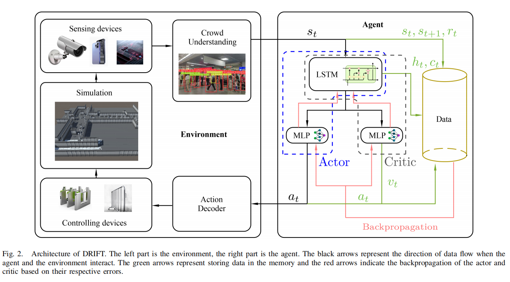
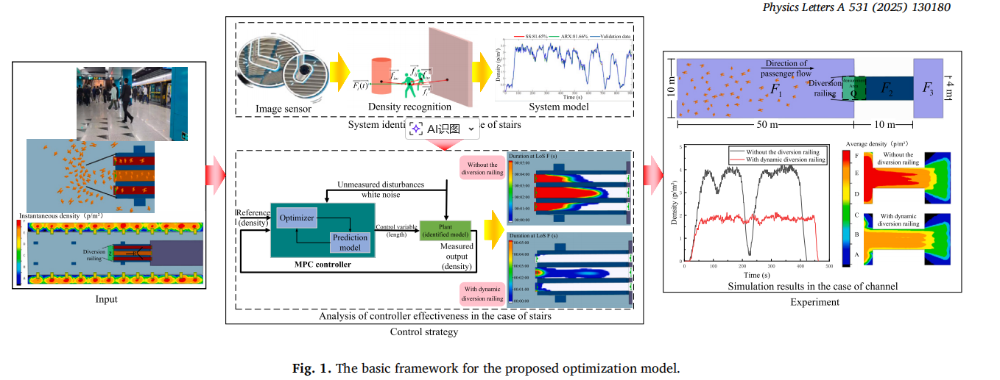

#  DRIFT: A Dynamic Crowd Inflow Control System Using LSTM-Based Deep Reinforcement Learning
## 基本信息
| 论文标题 | DRIFT: A Dynamic Crowd Inflow Control System Using LSTM-Based Deep Reinforcement Learning |
| --- | --- |
| 机构 | 南方科技大学 |
| 期刊 | IEEE TRANSACTIONS ON SYSTEMS, MAN, AND CYBERNETICS: SYSTEMS |
| 年份 | 2025 |

## 方法

### 控制对象
公共场所的每个入口（Entrance）： 具体控制对象是场景中各个入口的人群入流量（Crowd Inflow Rate）

### 控制输入
- 入流量控制动作（Action）： 控制输入是一个连续的动作向量，其中每个分量代表特定入口在当前时间步的目标入流量。
- 调节方式： 通过调节各个入口的入流速率来实施控制，而不是仅仅控制总流量或单一入口

### 控制目标
- 最大化吞吐量（Throughput）： 主要目标是最大化行人的平均吞吐量，定义为所有出口的平均出流量之和 。
- 保持场景稳定性与安全： 在最大化通过率的同时，必须防止场景内过度拥挤，避免踩踏风险，保持场景状态的稳定（通过约束条件和奖励函数中的惩罚项来实现）。

## 实验内容
### 实验设置（Setup）
#### 场景
 成都东站1层（CDD1F，包含24个起讫点对，较为开阔）和西直门火车站（XZM，包含12个起讫点对，地形更复杂)

### 收敛性分析
对比了动态控制策略（DRIFT、FCPPO和DQNIF）在训练过程中的奖励函数值变化

### 稳定性分析
评估各策略在长时间仿真（400-500次迭代）中，将场景内人数维持在稳定约束范围内的能力
### 吞吐量分析
吞吐量（即成功从入口走到出口的累计行人数）是该系统的终极优化目标

### 鲁棒性分析
- 系统在面对突发随机拥堵事件时的恢复能力

### 动作与拥堵机制分析
通过3D图表深入分析了不同策略在不同入口、不同时间步下采取的具体人群流入率（流入速度）分布

# Optimization modeling of automatic crowd regulation at bottlenecks of subway system: A model predictive control approach
## 基本信息
| 论文标题 | Optimization modeling of automatic crowd regulation at bottlenecks of subway system: A model predictive control approach |
| --- | --- |
| 机构 | 青岛科技大学 |
| 期刊 | Physics Letters A |
| 年份 | 2025 |

## 方法

### 控制对象
瓶颈区域的人群密度 (Crowd Density)：具体指地铁车站瓶颈处（如楼梯口或通道口）特定测量区域内的行人密度。本论文中，楼梯入口前的两个测量区域（区域 R 和区域 Z）的瞬时人群密度
### 控制输入
导流栏杆的长度 (Length of the railing)，栏杆长度被设定为离散的指令值。在实验设置中，栏杆长度在 20 度角下被设定为三个档位

### 控制目标
维持安全的人群密度水平：将测量区域内的人群密度维持在设定的参考值附近；
避免过度拥挤：减少或消除服务水平为 F (LoS F，即不可接受的过度拥挤) 的持续时间，防止由于高密度人群引发的踩踏风险。
### 控制方法
采用 MPC 框架来处理人群动态的不可预测性和复杂性；

由于人群动力学的未知性，论文使用“黑箱”方法建模。具体对比了线性 ARX 模型 (Auto-Regressive eXogenous) 和 状态空间模型 (State Space, SS)。研究发现 SS 模型在长期预测中表现更好，因此最终主要选用基于 SS 模型的 SMPC 控制器 。
混合整数二次规划 (MIQP)：由于控制输入（栏杆长度）是离散的，控制器需要解决混合整数二次规划问题来获得最优控制动作序列 。

## 实验内容
### 实验设置
#### 场景
楼梯/自动扶梯入口 (Stairs)：连接站台和站厅的楼梯，这是主要的研究案例。基于中国青岛某地铁站的实际场景建模。
平面通道 (Floor Channel)：单向流动的平面通道瓶颈，作为验证该方法通用性的第二个案例。

#### 仿真实验方法
1.	首先通过 MassMotion 生成不同栏杆长度下的人群流动数据（输入-输出数据集）。
2.	利用这些数据进行系统辨识，训练 ARX 和 SS 模型 。
3.	最后，将训练好的控制模型与 MassMotion 进行闭环仿真，控制器向仿真环境发送栏杆长度指令，仿真环境反馈实时密度，验证控制效果。

### 系统辨识模型评估
- 使用自回归外部输入（ARX）模型和状态空间（SS）模型对楼梯处的人群密度d₁和d₂进行建模
- 评估了模型在1步、10步和20步预测中的表现。结果表明，虽然两者在短期预测中表现均良好，但SS模型在长期预测（如20步）中的拟合度优于ARX模型
。同时发现，由于受人员流动性等更多复杂因素影响，d₂的建模难度高于d₁。

### 控制器（MPC）效能与稳定性分析

- 设定控制目标为将人群密度维持在安全需求标准的1.5人/m²
- 内部性能对比：通过引入阶跃扰动信号，对比了基于ARX模型的AMPC控制器和基于SS模型的SMPC控制器的参考跟踪能力。结果显示，SMPC控制器在稳定性和抗干扰能力上表现更优

### 实时控制效果与拥堵（LoS）缓解对比
- 将MPC控制器与MassMotion仿真器进行闭环集成，实时下发栏杆长度指令并反馈密度数据
- 实验表明，动态调整栏杆长度能有效将密度d₁控制在 1.5±0.2 p/m^2的合理波动范围内
​- 策略对比：引入了服务水平（LoS）的评价标准（特别是代表不可接受的过度拥挤的LoS F级）对比了“无栏杆”、“不同长度的固定栏杆”和“动态栏杆”策略。数据显示，动态栏杆控制策略将楼梯瓶颈处于LoS F高风险状态的持续时间降为0，在有效化解高密度风险与总通行时间之间取得了最佳平衡
### 通道场景的泛化验证

- 为了证明方法的普适性，实验进一步将系统应用于一个单向的楼层通道瓶颈场景
。
- 结果再次证实，在动态栏杆的控制下，测量区域内的人群密度变化更加平缓，有效避免了高密度行人流带来的风险

# Unit Sliding Mode Control for Disturbed Crowd Dynamics System Based on Integral Barrier Lyapunov Function

## 基本信息
| 论文标题 | Unit Sliding Mode Control for Disturbed Crowd Dynamics System Based on Integral Barrier Lyapunov Function |
| --- | --- |
| 机构 | Shandong Women’s University |
| 期刊 | IEEE Access |
| 年份 | 2020 |

## 实验内容
基于有限差分法，通过一维空间的数值仿真全面验证了所提控制器的有效性

### 仿真环境与控制目标设置
明确了空间长度(L=6)、扩散系数(D=0.1)、最大密度($ρ_m$=5)等系统参数，并设定了初始人群密度分布函数和时空正弦扰动项 β(x,t)

### “无控制”与“有控制”的基础对比分析
- 无控制状态：在仅有外部扰动的情况下，人群密度不仅扩散缓慢，而且根本无法稳定到参考密度
- 加入控制器（20）：系统密度变化平滑，在大约6秒后即可达到参考密度，并且人群密度和跟踪误差被全局严格约束在设定的安全阈值（3.6和1.1）内

### 时空切片的多维特征剖析
- 为了更清晰地展示动态演化，作者提取了空间切片（如 x=1 和 x=3 处密度随时间的变化）和时间切片（如 t=0.5s、3s、6s 时密度在空间上的分布）进行详细分析

- 数据显示，无控制时局部密度最高会达到 3.9（已突破3.6的安全约束边界），而所提控制器在任何时间和地点都将密度严格控制在目标范围内，并在6秒时完成参考密度的追踪