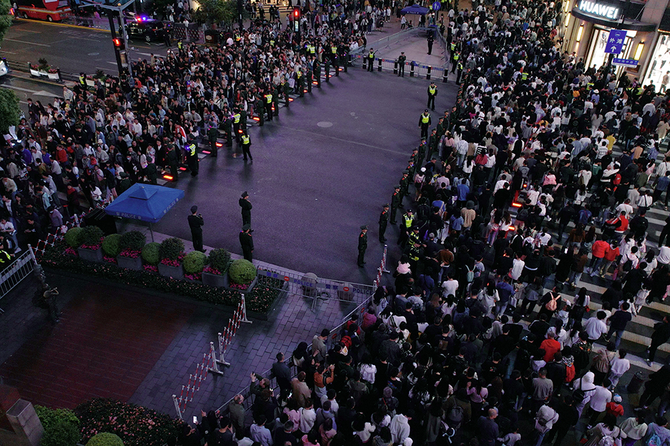

大规模人群集聚风险不仅威胁个体生命健康，更可能演变为影响社会秩序与公共安全的踩踏事件，其应对成效直接检验着城市治理能力与社会安全治理体系现代化水平\cite{GREIL-Crowds: Crowd Simulation with Deep Reinforcement Learning and Examples, Data-Driven Predictive Modeling of Citywide Crowd Flow for Urban Safety Management: A Case Study of Beijing, China}。随着节假日旅游、城市公共活动、商业街区促销、跨年庆典和重大赛事等高密度人群活动日益频繁，城市核心区域在短时间内承载远超日常水平的人流需求，给现场组织、通道管理、风险预警和应急调度带来了巨大挑战\cite{Modeling and simulation of crowd dynamics at evacuation bottlenecks during flood disasters, Macroscopic View: Crowd Evacuation Dynamics at T-Shaped Street Junctions Using a Modified Aw-Rascle Traffic Flow Model, Learning Collective Crowd Behaviors with Dynamic Pedestrian-Agents}。在此背景下，如何通过科学建模、数值仿真和优化方法，制定并评估人群管控策略，提高大型活动组织调度效率、降低局部拥挤风险、保障人民群众生命安全，已成为社会安全与城市治理领域亟待突破的重要科技问题\cite{Modelling collective decision making in groups and crowds: Integrating social contagion and interacting emotions, beliefs and intentions, Modelling crowd pressure and turbulence through a mixed-type continuum approach}。

在众多城市人群集聚场景中，开放式景区、滨水观景平台、历史商业街区和城市步行廊道具有较强代表性。这类区域通常并非封闭式场馆，而是由开放空间、主游览走廊、多个侧向连通通道、上下行阶梯、回流街道以及若干临时管控设施共同构成。与体育场、地铁站等边界较清晰的设施不同\cite{Stochastic user equilibrium path planning for crowd evacuation at subway station based on social force model, An Evolutionary Guardrail Layout Design Framework for Crowd Control in Subway Stations}，开放式城市景区往往具有多入口、多出口、多阶段游览、多方向交织和路线偏好差异等特点\cite{Analysing Urban Tourism Accessibility Using Real-Time Travel Data: A Case Study in Nanjing, China}。游客通常并非简单地从一个入口移动到一个出口，而是经历“进入景区—沿主游览走廊移动—停留观赏—选择通道离开—沿外部道路回流”等连续行为阶段\cite{Spatial Configuration and Online Attention: A Space Syntax Perspective}。因此，该类区域的人群流动既受到目的地选择、通道可达性和拥挤状态的影响，也受到空间几何、管控规则和历史行为偏好的共同作用\cite{Spatiotemporal tourist behaviour in urban destinations: a framework of analysis, Spatial Configuration and Online Attention: A Space Syntax Perspective}。

以上海南京东路—外滩区域为例，游客通常从南京东路方向进入外滩附近区域，通过多个阶梯通道登上观景平台，在平台上沿滨水方向游览后，再从若干南侧或相邻通道离开，并沿下街沿或外部道路回流。该场景可以抽象为一种典型的 “滨水平台—多阶梯通道” 人群流动场景，也可以进一步概括为 “具有主游览走廊、多侧向连通通道和返回流线的开放式景区”。在这类场景中，管控难点主要体现在三个方面：第一，多个通道同时承担进入、离开和分流功能，局部通道方向设置会改变整体流线组织；第二，主游览走廊与侧向通道之间存在明显的阶段性行为转换，单一的起终点模型难以准确刻画真实人群行为；第三，局部拥堵与全局路线选择相互反馈，某一通道的管控变化可能引发相邻区域负载重分配，进而影响系统整体安全性和效率。图 1 展示了某次节假日期间上海南京东路—外滩场景大规模客流。

大型活动中的流动人群是典型的复杂系统。大量具有不同期望速度、目的地、路线偏好和反应能力的个体，在有限空间中通过多尺度、非线性的相互作用形成群体层面的时空模式\cite{Pedestrian crowd flows in shared spaces: Investigating the impact of geometry based on micro and macro scale measures, Macroscopic View: Crowd Evacuation Dynamics at T-Shaped Street Junctions Using a Modified Aw-Rascle Traffic Flow Model}。宏观上，这些模式表现为目的地导向流动、通道汇聚、瓶颈排队、局部滞留、出口竞争、路线分流以及对管控规则的方向性响应\cite{The emergence of macroscopic interactions between intersecting pedestrian streams, Splitting scheme for a macroscopic crowd motion model with congestion for a two-typed population}；微观上，个体又会受到周围密度、可见路径、障碍边界、引导设施和群体从众行为的影响\cite{Advancing crowd forecasting with graphs across microscopic trajectory to macroscopic dynamics}。对于开放式景区而言，人群行为还具有明显的阶段性和随机性：游客可能先向观景平台移动，再沿主游览方向游览，随后根据自身偏好或引导选择不同离场通道\cite{Visitors' consistent stay behavior patterns within free-roaming scenic architectural complexes: Considering impacts of temporal, spatial, and environmental factors}。这种多阶段、多路线和共享拥堵并存的特征，使得传统的静态容量分析或单一最短路模型难以充分支撑精细化管控决策。

针对高聚集人群系统的复杂特性以及开放式城市景区的空间组织特点，现有大型活动安保管理实践通常综合运用系统动力学理论、系统耦合理论和系统安全理论，结合重点高风险区域划分、历史人群行为模式以及当前对人群流动起主导作用的事件因素，制定一系列人群行为管控措施\cite{A roadmap for the future of crowd safety research and practice: Introducing the Swiss Cheese Model of Crowd Safety and the imperative of a Vision Zero target, Automatic Crowd Navigation Path Planning in Public Scenes Through Multiobjective Differential Evolution}。这些措施包括在关键部位科学部署警力、设置临时围栏以形成有效隔离和分流、通过人工引导调控人群流向与流速、对重点通道实施单向通行、对核心区域实施批次放行，以及在局部高密度区域及时劝导游客离开等，从而提升整体安全保障效能\cite{Data-driven urban planning for proactive crowd management: Lessons from the 2022 Seoul Halloween crowd crush, IoMT-Assisted Medical Vehicle Routing Based on UAV-Borne Human Crowd Sensing and Deep Learning in Smart Cities}。例如，每逢国内重点节假日，上海市黄浦区南京东路—外滩区域会采取批次放行、通道通行方向调控、南进北出、减少对冲、通过警力配置控制进入外滩的人流速度、引导劝离驻足游客等措施\cite{关于印发《迎2023新年外滩、南京路等重点地区安全管理工作实施方案》的通知}。类似地，在客流高峰期，特别是重大节假日期间，北京市东城区南锣鼓巷主街也会实行单向通行措施，游客通常只能从南口进入、北口离开\cite{北京东城警方多措并举应对南锣鼓巷大客流}。同时，管理部门会在主街两侧重要路口部署安保和引导人员，通过扩音器、指示牌和现场劝导，引导游客按照规定路线行进，以避免人流对冲和局部拥堵\cite{北京东城警方多措并举应对南锣鼓巷大客流}。这与上海外滩区域的“南进北出”和通道方向调控在管控机理上具有一致性。

然而，当前城市大客流治理区域的管控措施仍在较大程度上依赖人工经验与静态预案。虽然这些措施在实际管理中具有重要价值，但在科学评估和精细优化方面仍存在不足\cite{Regulating multi-directional passenger flow: Impact of obstacle position and flow level on pedestrian merging process}。首先，许多管控方案主要基于历史经验制定，缺乏对不同通道方向配置、几何引导强度和阶段行为偏好影响的定量刻画。其次，现有方法往往更关注单点客流统计或局部密度监测，难以描述“通道方向规则—局部最优方向—群体密度演化—出口负载分配”之间的动态耦合关系\cite{大型活动的安保警力部署和调度优化研究}。再次，在开放式景区这类多入口、多通道、多阶段场景中，若忽略游客路线偏好和阶段转换行为，容易对通道负载和高风险区域位置产生误判。最后，许多已有仿真或优化方法将人群模型简单视为黑箱评估器，未能充分利用通道几何、单向规则和多路线子群体之间的结构信息\cite{Controlling pedestrian flows with moving walkways}，导致管控策略搜索效率不足\cite{DRIFT: A Dynamic Crowd Inflow Control System Using LSTM-Based Deep Reinforcement Learning}，也不利于解释优化结果。

为解决上述问题，本文面向“滨水平台—多阶梯通道”开放式景区场景，提出一种融合单向通行约束、几何引导和多阶段路线行为的宏观人群建模与管控优化方法。具体而言，本文构建 Bellman–守恒律耦合的人群连续介质模型：在密度演化层面，利用守恒律描述不同阶段、不同路线子群体的时空传播；在路径选择层面，为每个阶段—路线子群体建立独立势函数，并通过离散 Bellman 方程计算其最优方向；在拥堵反馈层面，不同子群体共享总密度所决定的速度—密度关系，从而实现多意图人群之间的相互影响。为了表达通道方向管控，本文将单向通行规则表示为局部允许方向集合的约束，使模型能够刻画只需单向（正逆向）通行和双向通行等不同配置对局部最优方向的影响。为了表达通道几何引导，本文引入各向异性度量张量，用于描述可通行区域内不同运动方向的代价差异，从而模拟行人在接近、进入和离开阶梯通道时的方向偏好与流线组织。
在管控优化方面，本文进一步区分“可控管控变量”和“外生行为参数”。通道方向配置与几何引导强度是管理方可以调控或设计的变量；而游客路线分流偏好反映人群在阶段转换时对不同路线或出口的选择倾向，应由历史数据识别得到，并在当前优化中作为固定外生参数输入模型，而不直接作为管理方可任意控制的变量。基于这一边界，本文以总旅行时间、高密度暴露时间和通道累计流量方差作为效率、安全和负载均衡指标，构造固定权重下的标量化优化问题，对可控变量进行搜索。为提高优化效率并增强结果可解释性，本文设计结构感知混合分块优化框架 SA-HBO，并在当前论文中实现其精简实例。该方法利用通道方向变量的离散邻域结构、几何引导变量的连续特征以及 Bellman 势场对局部管控变化的响应特性，通过代理预筛、全仿真确认、接受/回退机制和势场热启动等步骤，提高候选策略评估效率，同时避免将模型完全视为无结构黑箱。

本文的主要贡献如下。

1. 提出面向开放式景区的“滨水平台—多阶梯通道”人群流动建模框架。针对具有主游览走廊、多侧向连通通道和返回流线的城市景区场景，本文将游客行为表示为多阶段、多路线的连续介质流动过程。模型允许不同阶段—路线子群体拥有独立势函数和目标区域，同时共享总密度所决定的拥堵反馈，从而能够刻画目的地导向、路线偏好和局部拥挤相互耦合的人群演化过程。

2. 构建融合单向通行约束与几何引导的 Bellman–守恒律耦合模型。本文将通道方向管控表示为局部允许方向集合，使“正向”“逆向”和“双向”等规则能够直接作用于局部最优方向选择；同时引入各向异性度量张量，在可通行区域内刻画通道轴向与横向运动代价差异，从而模拟人群在通道口附近的提前对齐、平滑汇聚和流线重组行为。该建模方式为解释管控规则如何改变局部流动模式提供了机制基础。

3. 建立区分机制验证与策略优化的评价体系。本文将实验指标划分为行为机制指标和管控优化指标两类。机制验证阶段重点考察方向一致性、逆规则方向占比、接近角分布、提前对齐距离和通道捕获域等行为型指标，用于说明模型是否能够再现合理的人群流动行为；策略评估与优化阶段则采用总旅行时间、高密度暴露时间 和通道累计流量方，分别衡量效率、安全和负载均衡。该划分避免了以系统绩效指标替代模型机制验证的问题。

4. 设计面向可控通道配置的结构感知优化框架。在固定历史识别偏好参数的条件下，本文将当前优化变量限定为通道方向配置与几何引导强度，并提出 SA-HBO 的精简实例用于求解固定权重下的标量化管控优化问题。该框架通过离散邻域搜索处理通道方向配置，通过连续变量局部搜索处理几何引导强度，并结合代理预筛、全仿真确认、历史最优保留和接受/回退机制，提高优化过程的稳定性和可解释性。
本文的剩余部分组织如下：……

@article{RN2056,
   author = {Bode, Nikolai W. F. and Chraibi, Mohcine and Holl, Stefan},
   title = {The emergence of macroscopic interactions between intersecting pedestrian streams},
   journal = {Transportation Research Part B: Methodological},
   volume = {119},
   pages = {197–210},
   year = {2019},
   type = {Journal Article}
}

@article{RN1226,
   author = {Bosse, Tibor and Hoogendoorn, Mark and Klein, Michel C. A. and Treur, Jan and van der Wal, C. Natalie and van Wissen, Arlette},
   title = {Modelling collective decision making in groups and crowds: Integrating social contagion and interacting emotions, beliefs and intentions},
   journal = {Autonomous Agents and Multi-Agent Systems},
   volume = {27},
   number = {1},
   pages = {52–84},
   year = {2013},
   type = {Journal Article}
}

@article{RN2102,
   author = {Bourdin, Félicien},
   title = {Splitting scheme for a macroscopic crowd motion model with congestion for a two-typed population},
   journal = {Networks and Heterogeneous Media},
   volume = {17},
   number = {5},
   pages = {783–801},
   year = {2022},
   type = {Journal Article}
}

@article{RN2303,
   author = {Caldeira, A. M. and Kastenholz, E.},
   title = {Spatiotemporal tourist behaviour in urban destinations: a framework of analysis},
   journal = {Tourism Geographies},
   volume = {22},
   number = {1},
   pages = {22–50},
   year = {2020},
   type = {Journal Article}
}

@article{RN2147,
   author = {Charalambous, Panayiotis and Pettre, Julien and Vassiliades, Vassilis and Chrysanthou, Yiorgos and Pelechano, Nuria},
   title = {GREIL-Crowds: Crowd Simulation with Deep Reinforcement Learning and Examples},
   journal = {ACM Trans. Graph.},
   volume = {42},
   number = {4},
   pages = {Article 137},
   year = {2023},
   type = {Journal Article}
}

@article{RN2181,
   author = {Gu, Hanmin and Kim, Seoyoung and Jung, Minseung},
   title = {Data-driven urban planning for proactive crowd management: Lessons from the 2022 Seoul Halloween crowd crush},
   journal = {Cities},
   volume = {168},
   pages = {1–14},
   year = {2026},
   type = {Journal Article}
}

@article{RN2176,
   author = {Haghani, Milad and Coughlan, Matt and Crabb, Ben and Dierickx, Anton and Feliciani, Claudio and van Gelder, Roderick and Geoerg, Paul and Hocaoglu, Nazli and Laws, Steve and Lovreglio, Ruggiero and Miles, Zoe and Nicolas, Alexandre and O'Toole, William J. and Schaap, Syan and Semmens, Travis and Shahhoseini, Zahra and Spaaij, Ramon and Tatrai, Andrew and Webster, John and Wilson, Alan},
   title = {A roadmap for the future of crowd safety research and practice: Introducing the Swiss Cheese Model of Crowd Safety and the imperative of a Vision Zero target},
   journal = {Safety Science},
   volume = {168},
   pages = {106292},
   year = {2023},
   type = {Journal Article}
}

@article{RN1998,
   author = {Jiang, He and Zhang, Xuxilu and Dong, Yao and Wang, Jianzhou},
   title = {Data-Driven Predictive Modeling of Citywide Crowd Flow for Urban Safety Management: A Case Study of Beijing, China},
   journal = {Journal of Forecasting},
   volume = {44},
   number = {2},
   pages = {730–752},
   year = {2025},
   type = {Journal Article}
}

@article{RN2304,
   author = {Li, J. C. and Guo, X. C. and Lu, R. Y. and Zhang, Y. B.},
   title = {Analysing Urban Tourism Accessibility Using Real-Time Travel Data: A Case Study in Nanjing, China},
   journal = {Sustainability},
   volume = {14},
   number = {19},
   year = {2022},
   type = {Journal Article}
}

@article{RN2059,
   author = {Liang, Haoyang and Yang, Liangze and Du, Jie and Shu, Chi-Wang and Wong, S. C.},
   title = {Modelling crowd pressure and turbulence through a mixed-type continuum approach},
   journal = {Transportmetrica B: Transport Dynamics},
   volume = {12},
   number = {1},
   pages = {2328774},
   year = {2024},
   type = {Journal Article}
}

@article{RN2122,
   author = {Liao, X. C. and Chen, W. N. and Guo, X. Q. and Zhong, J. and Wang, D. J.},
   title = {DRIFT: A Dynamic Crowd Inflow Control System Using LSTM-Based Deep Reinforcement Learning},
   journal = {IEEE Transactions on Systems, Man, and Cybernetics: Systems},
   volume = {55},
   number = {6},
   pages = {4202–4215},
   year = {2025},
   type = {Journal Article}
}

@article{RN2301,
   author = {Liu, P. X. and Xiao, X. and Zhang, J. and Wu, R. H. and Zhang, H. L.},
   title = {Spatial Configuration and Online Attention: A Space Syntax Perspective},
   journal = {Sustainability},
   volume = {10},
   number = {1},
   year = {2018},
   type = {Journal Article}
}

@article{RN2146,
   author = {Molyneaux, Nicholas and Bierlaire, Michel},
   title = {Controlling pedestrian flows with moving walkways},
   journal = {Transportation Research Part C: Emerging Technologies},
   volume = {141},
   pages = {103672},
   year = {2022},
   type = {Journal Article}
}

@article{RN1978,
   author = {Rezaee, Khosro and Khosravi, Mohammad R. and Attar, Hani and Menon, Varun G. and Khan, Mohammad Ayoub and Issa, Haitham and Qi, Lianyong},
   title = {IoMT-Assisted Medical Vehicle Routing Based on UAV-Borne Human Crowd Sensing and Deep Learning in Smart Cities},
   journal = {IEEE Internet of Things Journal},
   volume = {10},
   number = {21},
   pages = {18529–18536},
   year = {2023},
   type = {Journal Article}
}

@article{RN1100,
   author = {Shahhoseini, Zahra and Sarvi, Majid},
   title = {Pedestrian crowd flows in shared spaces: Investigating the impact of geometry based on micro and macro scale measures},
   journal = {Transportation Research Part B: Methodological},
   volume = {122},
   pages = {57–87},
   year = {2019},
   type = {Journal Article}
}

@article{RN2154,
   author = {Shi, Dongdong and Li, Jialin and Wang, Qiao and Chen, Juan and Lovreglio, Ruggiero and Lo, Jacqueline T. Y. and Ma, Jian},
   title = {Modeling and simulation of crowd dynamics at evacuation bottlenecks during flood disasters},
   journal = {Transportation Research Part E: Logistics and Transportation Review},
   volume = {198},
   pages = {104064},
   year = {2025},
   type = {Journal Article}
}

@article{RN2302,
   author = {Wang, L. Y. and Huang, W. X.},
   title = {Visitors' consistent stay behavior patterns within free-roaming scenic architectural complexes: Considering impacts of temporal, spatial, and environmental factors},
   journal = {Frontiers of Architectural Research},
   volume = {13},
   number = {5},
   pages = {990–1008},
   year = {2024},
   type = {Journal Article}
}

@article{RN2174,
   author = {Xie, Chuan-Zhi Thomas and Xu, Junhao and Zhu, Bin and Tang, Tie-Qiao and Lo, Siuming and Zhang, Botao and Tian, Yijun},
   title = {Advancing crowd forecasting with graphs across microscopic trajectory to macroscopic dynamics},
   journal = {Information Fusion},
   volume = {106},
   pages = {102275},
   year = {2024},
   type = {Journal Article}
}

@article{RN761,
   author = {Yang, Xiaoxia and Zhang, Rui and Pan, Fuquan and Yang, Yi and Li, Yongxing and Yang, Xiaoli},
   title = {Stochastic user equilibrium path planning for crowd evacuation at subway station based on social force model},
   journal = {Physica A: Statistical Mechanics and its Applications},
   volume = {594},
   pages = {127033},
   year = {2022},
   type = {Journal Article}
}

@article{RN1662,
   author = {Yu, Hanchen and Jiang, Nan and Li, Maoyu and Jia, Xinmiao and Shi, Jixin and Wai Ming Lee, Eric and Yang, Lizhong},
   title = {Regulating multi-directional passenger flow: Impact of obstacle position and flow level on pedestrian merging process},
   journal = {Tunnelling and Underground Space Technology},
   volume = {157},
   pages = {106336},
   year = {2025},
   type = {Journal Article}
}

@article{RN1193,
   author = {Zhao, R. and Wang, D. and Wang, Y. and Han, C. and Jia, P. and Li, C. and Ma, Y.},
   title = {Macroscopic View: Crowd Evacuation Dynamics at T-Shaped Street Junctions Using a Modified Aw-Rascle Traffic Flow Model},
   journal = {IEEE Transactions on Intelligent Transportation Systems},
   volume = {22},
   number = {10},
   pages = {6612–6621},
   year = {2021},
   type = {Journal Article}
}

@article{RN2194,
   author = {Zhong, J. and Cheng, T. and Liu, W. L. and Yang, P. and Lin, Y. and Zhang, J.},
   title = {An Evolutionary Guardrail Layout Design Framework for Crowd Control in Subway Stations},
   journal = {IEEE Transactions on Computational Social Systems},
   volume = {10},
   number = {1},
   pages = {297–310},
   year = {2023},
   type = {Journal Article}
}

@article{RN1663,
   author = {Zhong, Jinghui and Li, Dongrui and Cai, Wentong and Chen, Wei-Neng and Shi, Yuhui},
   title = {Automatic Crowd Navigation Path Planning in Public Scenes Through Multiobjective Differential Evolution},
   journal = {IEEE Transactions on Computational Social Systems},
   volume = {11},
   number = {1},
   pages = {905–918},
   year = {2024},
   type = {Journal Article}
}

@article{RN673,
   author = {Zhou, B. L. and Tang, X. O. and Wang, X. G.},
   title = {Learning Collective Crowd Behaviors with Dynamic Pedestrian-Agents},
   journal = {International Journal of Computer Vision},
   volume = {111},
   number = {1},
   pages = {50–68},
   year = {2015},
   type = {Journal Article}
}

@misc{RN2129,
   author = {上海市公安局黄浦分局},
   title = {关于印发《迎2023新年外滩、南京路等重点地区安全管理工作实施方案》的通知},
   volume = {2022},
   number = {12-19},
   year = {2022},
   type = {Web Page}
}

@article{RN2124,
   author = {吴道霞 and 刁海璨},
   title = {大型活动的安保警力部署和调度优化研究},
   journal = {系统工程理论与实践},
   volume = {42},
   number = {03},
   pages = {789–800},
   year = {2022},
   type = {Journal Article}
}

@misc{RN2130,
   author = {央视网},
   title = {北京东城警方多措并举应对南锣鼓巷大客流},
   volume = {2021},
   number = {10-08},
   year = {2021},
   type = {Web Page}
}

