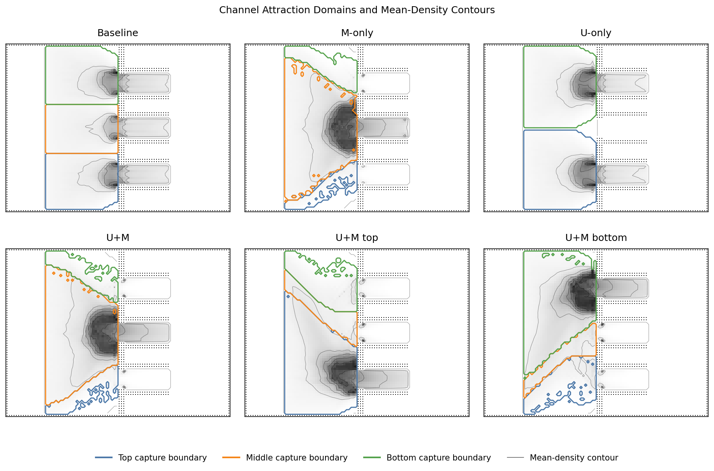
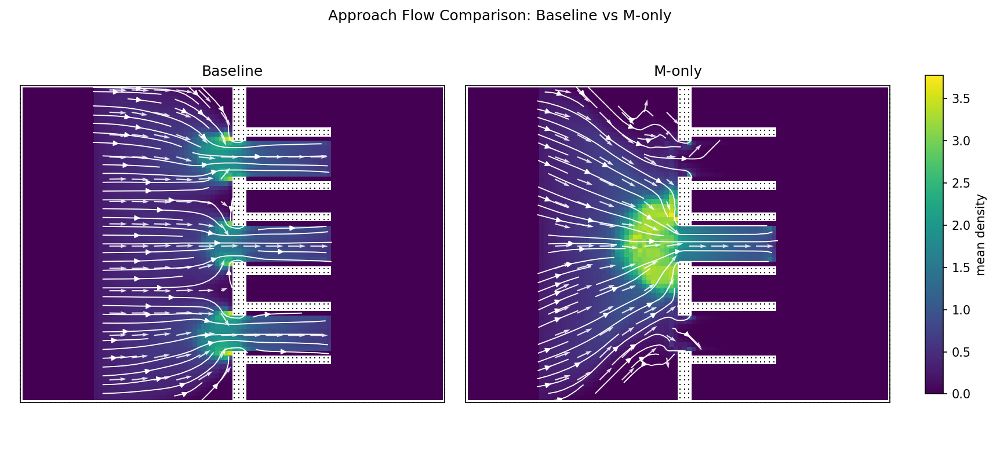
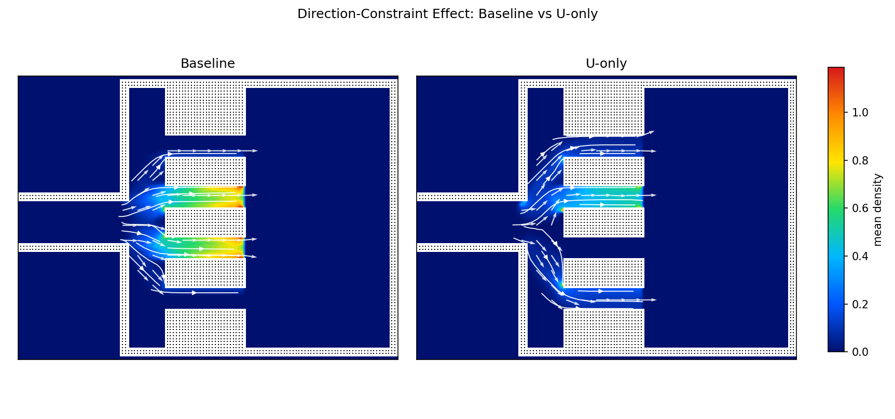
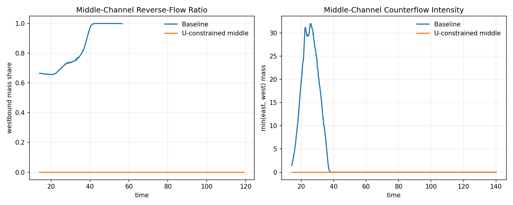
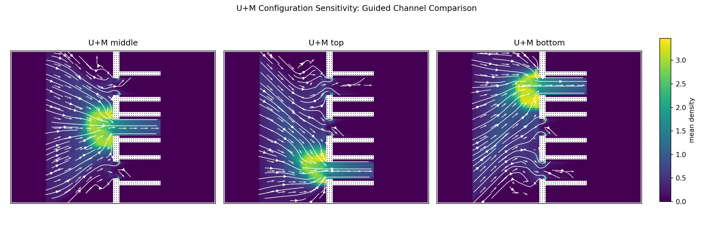
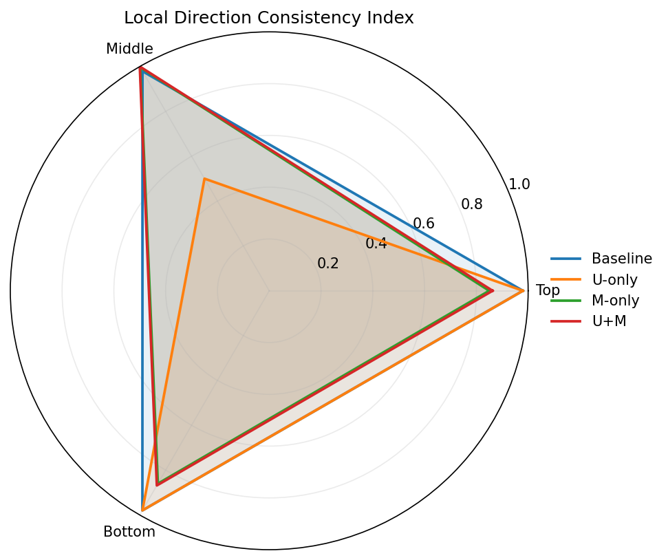
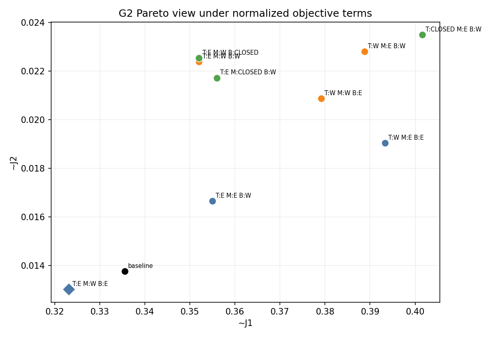
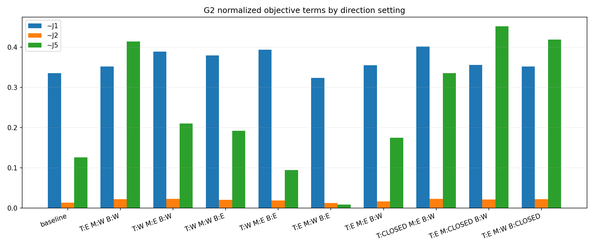
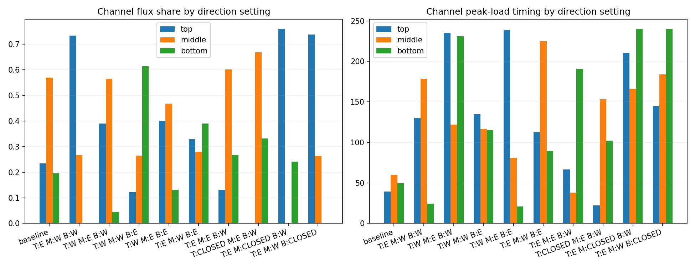
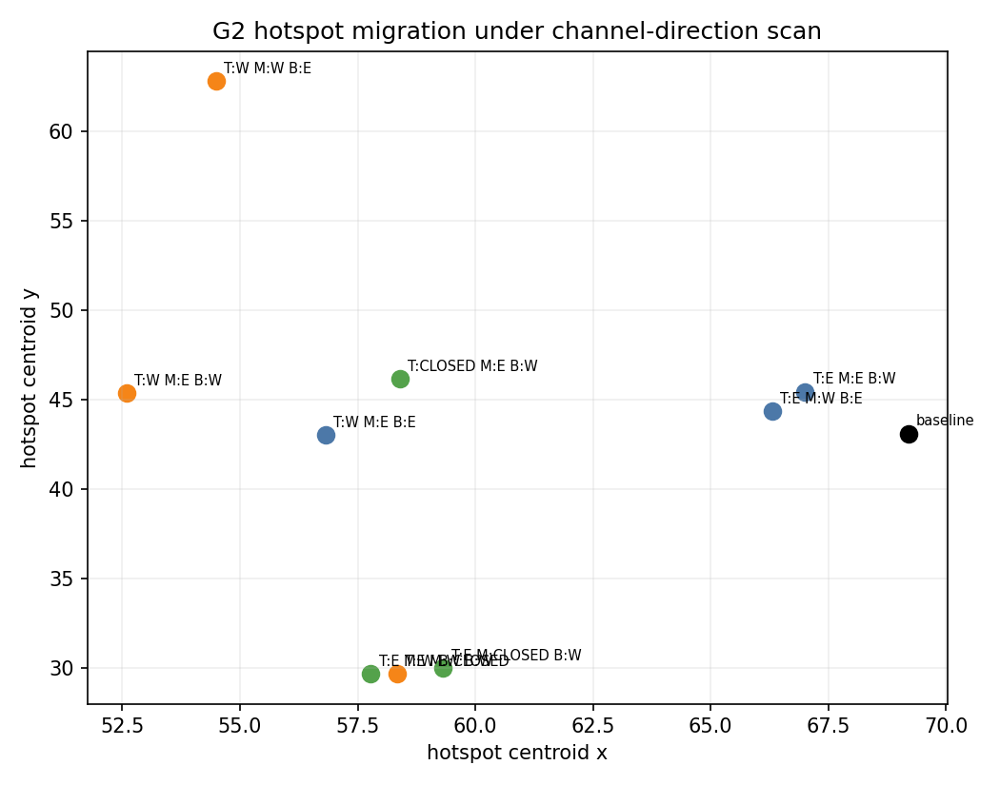

# 5 实验

本章通过数值实验验证模型机制的合理性、管控策略的有效性以及优化方法的可行性。实验设计遵循两层验证逻辑：首先验证模型机制是否真实改变人群局部行为，然后验证不同管控策略在效率、安全与均衡性上的差异，最后验证多阶段行为链与分流机制的影响以及最优控制参数求解的有效性。

## 5.1 实验场景与设置

### 5.1.1 三通道主场景

实验采用三通道主场景作为机制验证和策略对比的基础。该场景几何构型如下：左侧为初始人群区域，右侧为出口区域，中部隔墙上设置上、中、下三条通道。人群需从左侧区域经通道到达右侧出口。

**[配图注释：在此处插入三通道场景几何示意图，标注左侧初始区域、右侧出口区域、三条通道位置及坐标系]**

数值参数设置：网格分辨率 $128\times96$，网格间距 $\Delta x=0.5$，自由流速度 $v_{\max}=1.5$，最大密度 $\rho_{\max}=5.0$，初始密度 $\rho_{\text{init}}=2.2$，CFL系数 $0.9$，最大仿真步数 $2000$，时间上限 $140$。密度安全阈值 $\rho_{\text{safe}}=3.5$，人群采用持续流入模式生成。

### 5.1.2 评价指标

实验采用三类原始物理指标及其对应的标准化指标进行评价。原始 $J_i$ 保留物理解释，标准化 $\tilde J_i$ 用于跨方案比较、Pareto 判断与标量化目标计算：

**[表格注释：在此处插入表1，指标定义与说明表，包含指标符号、数学定义、物理含义、代码字段名]**

| 原始指标 | 标准化指标 | 定义 | 物理含义 |
|------|------|------|----------|
| $J_1$ | $\tilde J_1=J_1/(M_{\mathrm{tot}}T)$ | $\int_0^T\int_\Omega\rho(x,t)\,dx\,dt$ | 总旅行时间；$\tilde J_1$ 表示单位总人群质量的相对滞留比例 |
| $J_2$ | $\tilde J_2=J_2/(|\Omega_w|T)$ | $\int_0^T\int_\Omega\mathbf{1}_{\rho>\rho_{\text{safe}}}\,dx\,dt$ | 高密度暴露时间；$\tilde J_2$ 表示风险暴露时空占比 |
| $J_5$ | $\tilde J_5=\mathrm{Var}(F_1,\dots,F_m)/(F^2(m-1)/m^2)$ | $\mathrm{Var}(F_1,\dots,F_m)$ | 通道流量方差；$\tilde J_5$ 表示归一化负载不均衡程度 |

行为形态指标包括：通道捕获域占比、通道流量占比、方向一致性指数、接近角分布等。

## 5.2 模型机制验证

### 5.2.1 验证目标与逻辑

模型机制验证的核心任务是回答两个基础问题：第一，几何引导 $M(x)$ 和方向约束 $U(x)$ 是否真实改变了人群在局部的决策与流动形态；第二，当通道配置变化时，模型是否产生足够敏感、可解释的行为响应。这一验证是后续策略评估与优化研究的前提，因为若机制不能正确反映人群行为，则优化结果将建立在失真的行为模型之上。

验证分为两部分：第一部分验证机制真实性，通过对比基线、仅启用 $U$、仅启用 $M$ 和联合启用 $U+M$ 四类配置，检验各机制是否产生预期的局部行为改变；第二部分验证管理可用性，检验 $U+M$ 联合模型是否能对不同的通道配置（上通道受控、中通道受控、下通道受控）给出明显可区分的行为响应。

### 5.2.2 几何引导 $M(x)$ 的行为效应

为验证几何引导是否改变通道接近方式与吸引域结构，设置对比实验：基线配置（无 $M$、无 $U$）与仅启用几何引导配置（$M$-only，中通道施加各向异性引导）。

**图1 G1实验通道吸引域与平均密度等高线对比。** 蓝色、橙色和绿色曲线分别表示上、中、下通道的捕获域边界，灰度背景和细灰线表示时间平均密度及其等高线。

实验结果显示，基线配置下三通道捕获域近似均衡：上通道 $33.73\%$、中通道 $30.00\%$、下通道 $34.98\%$。通道流量占比也呈现均衡分布：上通道 $33.82\%$、中通道 $32.35\%$、下通道 $33.83\%$。

而在 $M$-only 配置下，中通道捕获域显著扩大至 $63.41\%$，中通道流量占比跃升至 $99.32\%$。这一结果表明，几何引导 $M(x)$ 足以重塑局部吸引域结构，使人群更早地向中通道靠拢，且接近方式发生了实质性改变。

从图1可以更直观地看到这一机制差异。基线配置下，三条通道的捕获域边界大致按照通道纵向位置分割，平均密度热点分别出现在三个通道入口附近，说明无引导时人群主要依据几何距离自然分流。引入 $M(x)$ 后，中通道对应的橙色捕获域明显向上、下两侧扩张，并在中通道入口前形成更集中的高密度等高线，表明各向异性度量并非简单改变全局指标，而是在通道入口前重构了局部吸引域和接近路径。相比之下，$U$-only 面板主要体现可行方向约束对通道可达性的排除作用，而 $U+M$ 及其上、下通道变体则显示捕获域会随引导通道位置发生系统性迁移。因此，图1支持的结论是：$M(x)$ 的核心行为效应是改变“人群被哪条通道吸引以及何时开始向该通道对齐”，而不是直接禁止某条路径；这种软引导机制为后续 $U+M$ 联合管控提供了连续、可解释的流线重组基础。

**图2 G1实验基线与 $M$-only 接近流线对比。** 左图为基线配置，右图为 $M$-only 配置；白色流线和箭头表示时间平均运动方向，背景颜色表示时间平均密度。

图2进一步揭示了 $M(x)$ 对接近过程的影响。基线配置下，左侧来流在靠近隔墙前才分别转向三条通道，整体呈现近似平行进入、通道口局部转向的形态；而 $M$-only 配置下，流线在更靠左的位置即开始向中通道收束，入口前形成扇形汇聚，并在中通道入口附近产生更集中的平均密度热点。这说明几何引导改变的是接近路径和转向位置，使行人在进入瓶颈前完成预对齐，而不是仅在通道内部改变速度方向。

### 5.2.3 方向约束 $U(x)$ 的行为效应

为验证方向约束是否改变局部最优方向与通道选择结构，设置对比实验：基线配置与仅启用单向约束配置（$U$-only，中通道设为仅允许向东）。

**图3 G1实验方向约束局部方向场对比。** 左图为基线配置，右图为 $U$-only 配置；白色流线和箭头表示时间平均运动方向，背景颜色表示时间平均密度。

实验结果显示，$U$-only 配置下中通道捕获域降为 $0$，中通道流量占比降为 $0$，上下通道分流比例接近 $50/50$。这说明 $U(x)$ 确实显著改写了局部可行路径选择，但单向来流实验不足以证明其对逆行与对冲的抑制效应。

图3进一步说明了这一点。基线配置下，入口前的方向场分别指向上、中、下三条通道，中通道仍保持清晰的东向通行流线；而在 $U$-only 配置下，中通道被方向约束从可行选择中排除，原本接近中通道的流线在通道口前发生分离，并转向上、下两条可通行通道。该图说明 $U(x)$ 的主要作用不是平滑诱导，而是通过改变局部允许方向集合，直接重构可达通道与路径选择结构。

为此补充双向来流子实验：设置双向基线（同时存在西向东与东向西人群）与双向单向规则（中通道仅允许向东）两组配置。

| 配置 | 中通道西向占比 | 逆行质量时间 | 对冲单元时间 |
|------|----------------|--------------|--------------|
| 双向基线 | $72.10\%$ | $188.15$ | $887.70$ |
| 中通道单向规则 | $0$ | $0$ | $0$ |

双向实验结果表明，当中通道施加单向规则后，东向西人群被完全排除出中通道，中通道内的逆行占比、逆行质量时间与对冲单元时间均被压至零。这证明 $U(x)$ 不仅改变路径选择，更在存在双向来流时有效抑制了逆行与迎面对冲。

**图3(b) G1实验双向来流下中通道逆向流动动态对比。** 左图展示中通道西向质量占比随时间变化，右图展示中通道对冲强度随时间变化。

图3(b)显示，在双向基线中，中通道西向占比长期维持在较高水平，并伴随持续的对冲质量；施加中通道单向规则后，两条曲线均迅速压至零并保持稳定。这说明方向约束 $U(x)$ 对双向对冲的抑制不是短时偶然结果，而是在整个观察时段内持续生效的结构性改变。

### 5.2.4 $U+M$ 联合效应与配置敏感性

为验证 $U+M$ 联合模型是否能对不同通道配置产生可区分的行为响应，设置三组配置：中通道受控（$U+M$-middle）、上通道受控（$U+M$-top）、下通道受控（$U+M$-bottom）。

| 配置 | 主导捕获通道 | 主导流量通道 | 上通道捕获域 | 中通道捕获域 | 下通道捕获域 | 上通道流量 | 中通道流量 | 下通道流量 |
|------|--------------|--------------|--------------|--------------|--------------|------------|------------|------------|
| $U+M$-middle | 中通道 | 中通道 | $11.29\%$ | $62.63\%$ | $12.95\%$ | $0.40\%$ | $98.87\%$ | $0.72\%$ |
| $U+M$-top | 上通道 | 上通道 | $57.37\%$ | $12.76\%$ | $22.26\%$ | $95.15\%$ | $0.74\%$ | $4.11\%$ |
| $U+M$-bottom | 下通道 | 下通道 | $20.55\%$ | $11.98\%$ | $58.06\%$ | $2.98\%$ | $0.70\%$ | $96.31\%$ |

实验结果显示，$U+M$ 联合模型对配置变化具有稳定且可解释的响应：当中通道受控时，中通道成为主导捕获通道与主导流量通道；当上通道受控时，上通道成为主导；当下通道受控时，下通道成为主导。这说明联合模型足以区分不同管控方案，可作为后续策略比较与优化评估器的基础。

**图4 G1实验 $U+M$ 联合机制配置敏感性流场对比。** 三个子图分别对应中通道、上通道和下通道受控配置；白色流线和箭头表示时间平均运动方向，背景颜色表示时间平均密度。

从图4可以看出，受控通道位置变化会引起密度热点和接近流线的同步迁移：中通道受控时，人群在中通道入口前集中并沿中通道通过；上通道受控时，主导汇聚区域移动到上通道入口；下通道受控时，主导汇聚区域转移到下通道入口。该结果与表3中的主导捕获通道和主导流量通道一致，说明 $U+M$ 联合机制不仅能表达单条通道的局部规则，还能对不同空间配置产生可区分、可解释的整体流场重组。

### 5.2.5 机制验证结论

综合上述实验结果，可得出以下结论：

第一，几何引导 $M(x)$ 会显著改变局部接近方式与通道吸引域，使人群更早对齐通道轴线，实现平滑汇聚而非临门急转。

第二，方向约束 $U(x)$ 会重塑局部可行路径与方向组织，在双向来流下能够有效抑制逆行与迎面对冲。

第三，$U+M$ 联合模型对不同通道配置具有明确敏感性，能够产生既符合规则、又具有真实局部流型的行为响应。

第四，若去掉 $U$ 或 $M$ 其中之一，模型对配置变化的响应将变得不完整或缺乏行为合理性，后续优化研究必须建立在联合机制之上。

**图5 G1实验局部方向一致性雷达图。** 雷达图按上、中、下三条通道汇总不同机制配置下的局部方向一致性指数，数值越接近 $1$ 表示局部流向越集中、越符合东向通行组织。

图5从方向组织角度补充验证了前述空间流场结论。基线配置下三条通道方向一致性较为接近，反映自然分流状态下各通道均承担一定东向流动；$U$-only 配置消除了中通道通行，因此中通道一致性不再形成有效观测，而上下通道保持较高一致性；$M$-only 与 $U+M$ 配置下，中通道方向一致性分别达到 $0.992$ 与 $1.000$，说明几何引导和方向约束共同作用时，不仅通道选择被重组，通道内部的局部方向组织也更集中。综合图1-图5，G1实验表明本文模型中的 $M(x)$ 和 $U(x)$ 能分别表达软引导与硬约束，并在联合使用时产生空间上可解释、统计上可辨识的机制响应。

---

## 5.3 主场景策略对比

### 5.3.1 实验目标与设计

本节实验用于检验多阶段游览-离场场景中，通道方向配置对系统效率、安全性与通道负载均衡的影响。与5.2节的局部机制验证不同，本节把人群行为链扩展为“进场-平台游览-返回离场”，并在完整行为层下比较不同方向管控方案的全局响应。策略排序、非支配判断与综合目标均采用仿真程序输出的标准化指标 $\tilde J_1,\tilde J_2,\tilde J_5$；原始 $J_1,J_2,J_5$ 用于保留物理量解释。

实验共设置十组通道方向配置：一组基线配置、三组单一进场通道配置、三组单一回流通道配置和三组单通道关闭配置。基线配置中三条通道均可自由双向通行；single_entry 族仅保留一条东向进场通道，其余通道作为西向回流通道；single_return 族仅保留一条西向回流通道，其余两条作为东向进场通道；one_closed 族关闭上、中、下某一条通道，并在剩余通道中保留一条进场和一条回流路径。具体配置见表4。

| case编号 | 策略族 | 上通道 | 中通道 | 下通道 | 进场通道 | 回流通道 | 关闭通道 |
|---------|--------|--------|--------|--------|----------|----------|----------|
| baseline | 基线 | FREE | FREE | FREE | 全部 | 全部 | 无 |
| case2 | single_entry | 东向 | 西向 | 西向 | top | middle,bottom | 无 |
| case3 | single_entry | 西向 | 东向 | 西向 | middle | top,bottom | 无 |
| case4 | single_entry | 西向 | 西向 | 东向 | bottom | top,middle | 无 |
| case5 | single_return | 西向 | 东向 | 东向 | middle,bottom | top | 无 |
| case6 | single_return | 东向 | 西向 | 东向 | top,bottom | middle | 无 |
| case7 | single_return | 东向 | 东向 | 西向 | top,middle | bottom | 无 |
| case8 | one_closed | 关闭 | 东向 | 西向 | middle | bottom | top |
| case9 | one_closed | 东向 | 关闭 | 西向 | top | bottom | middle |
| case10 | one_closed | 东向 | 西向 | 关闭 | top | middle | bottom |

**图6 G2实验三目标 Pareto 散点图。** 横轴为效率指标 $\tilde J_1$，纵轴为安全指标 $\tilde J_2$；点的颜色区分策略族，菱形点表示非支配解。

### 5.3.2 系统响应差异分析

表5给出十组配置的原始指标、标准化指标与等权综合目标 $\tilde J=\tilde J_1+\tilde J_2+\tilde J_5$。结果显示，case6（上、下通道东向进场，中通道西向回流）在三项标准化指标上均取得最小值：$\tilde J_1=0.3231$、$\tilde J_2=0.01301$、$\tilde J_5=0.0090$，综合目标为 $0.3451$。相对 baseline，case6 将 $\tilde J_1$ 降低约 $3.7\%$、$\tilde J_2$ 降低约 $5.4\%$、$\tilde J_5$ 降低约 $92.9\%$，说明中通道专属回流配合上下通道进场能够同时改善效率、安全与通道负载均衡。

| case编号 | 策略族 | $J_1$ | $J_2$ | $J_5$ | $\tilde J_1$ | $\tilde J_2$ | $\tilde J_5$ | $\tilde J$ | 累计离场量 |
|---------|--------|-------|-------|-------|-------------|-------------|-------------|-----------|-----------|
| baseline | 基线 | 188709 | 9488 | 170634 | 0.3355 | 0.01375 | 0.1263 | 0.4755 | 328.5 |
| case2 | single_entry | 199111 | 15441 | 306960 | 0.3520 | 0.02238 | 0.4139 | 0.7883 | 282.0 |
| case3 | single_entry | 217485 | 15729 | 415269 | 0.3888 | 0.02280 | 0.2106 | 0.6221 | 177.7 |
| case4 | single_entry | 213275 | 14397 | 190270 | 0.3791 | 0.02087 | 0.1920 | 0.5920 | 277.4 |
| case5 | single_return | 219689 | 13129 | 215104 | 0.3933 | 0.01903 | 0.0947 | 0.5070 | 163.9 |
| case6 | single_return | **183637** | **8975** | **11315** | **0.3231** | **0.01301** | **0.0090** | **0.3451** | 311.4 |
| case7 | single_return | 200008 | 11484 | 265067 | 0.3550 | 0.01665 | 0.1746 | 0.5462 | **413.2** |
| case8 | one_closed | 225768 | 16205 | 456275 | 0.4015 | 0.02349 | 0.3349 | 0.7600 | 291.6 |
| case9 | one_closed | 201395 | 14982 | 301449 | 0.3560 | 0.02172 | 0.4517 | 0.8294 | 291.0 |
| case10 | one_closed | 199123 | 15540 | 313208 | 0.3520 | 0.02253 | 0.4185 | 0.7931 | 282.3 |

**图7 G2实验标准化目标对比柱状图。** 三组柱分别表示 $\tilde J_1$、$\tilde J_2$ 和 $\tilde J_5$，用于比较各方向配置在效率、安全与均衡性上的差异。

从策略族看，single_entry 族整体表现较差。case2、case3 和 case4 均只保留一条东向进场通道，进场瓶颈被压缩后，高密度暴露均升至 $14397$-$15729$，综合目标也高于 baseline。single_return 族内部差异较大：case5 将上通道作为唯一回流通道，导致中通道暴露仍然很高；case7 虽然累计离场量最高，但安全指标和均衡性均明显劣于 case6；case6 则通过上下双进场和中通道单回流，使进场与回流在空间上分离，是该族中唯一同时降低三类目标的方案。one_closed 族没有产生新的优势方案，说明在当前持续客流强度下，关闭任一通道都会削弱系统冗余并放大局部瓶颈风险。

### 5.3.3 通道负载与热点迁移

通道方向配置首先改变的是各通道累计流量占比。表6显示，baseline 的流量主要集中在中通道，占比为 $56.9\%$；case6 的三通道流量占比分别为 $32.9\%$、$28.1\%$ 和 $39.0\%$，是全部方案中最接近均匀分配的配置。关闭策略则表现出明显的补偿性转移：case8 关闭上通道后，中通道承担 $66.8\%$ 的流量；case9 关闭中通道后，上通道承担 $75.9\%$；case10 关闭下通道后，上通道承担 $73.7\%$。

| case | 上通道占比 | 中通道占比 | 下通道占比 | 上通道暴露 | 中通道暴露 | 下通道暴露 |
|------|-----------|-----------|-----------|-----------|-----------|-----------|
| baseline | 23.5% | 56.9% | 19.6% | 14.7 | 892.4 | 19.9 |
| case2 | 73.4% | 26.6% | 0.0% | 704.7 | 50.1 | 0.0 |
| case3 | 39.0% | 56.5% | 4.5% | 10.8 | 1034.5 | 0.0 |
| case4 | 12.1% | 26.5% | 61.3% | 0.0 | 0.0 | 529.0 |
| case5 | 40.1% | 46.7% | 13.2% | 82.4 | 1367.1 | 8.5 |
| case6 | **32.9%** | **28.1%** | **39.0%** | 394.7 | **0.0** | 324.4 |
| case7 | 13.2% | 60.1% | 26.8% | 14.4 | 907.6 | 90.6 |
| case8 | 0.0% | 66.8% | 33.2% | 0.0 | 1345.0 | 31.4 |
| case9 | 75.9% | 0.0% | 24.1% | 570.5 | 9.0 | 72.6 |
| case10 | 73.7% | 26.3% | 0.0% | 712.7 | 48.1 | 0.0 |

**图8 G2实验通道流量占比与峰值负载时刻。** 左图为各配置下上、中、下三通道的累计流量占比；右图为各通道达到峰值负载的时刻。

高密度暴露的分布进一步说明，风险并不只由总流量决定，还受到方向组织和回流位置影响。baseline 中通道暴露达到 $892.4$，说明自由双向通行时中通道仍是主要风险位置。case5 和 case8 分别使中通道暴露升至 $1367.1$ 和 $1345.0$，表明当中通道同时承担主要进场或回流压力时，局部风险会被显著放大。case6 虽然上、下通道仍存在一定高密度暴露，但中通道暴露降为 $0$，且三通道负载更加均衡，因此综合目标最低。

表7给出各配置下高密度热点中心与峰值时刻。热点位置随主导通道发生系统性迁移：case2、case9 和 case10 的热点均迁移至上通道附近（$y\approx30$）；case4 的热点迁移至下通道附近（$y=62.8$）；case3、case5 和 case8 的热点位于中通道或平台中部附近。case6 的热点中心为 $(66.3,44.4)$，接近场景中轴，同时避开了 baseline 中通道入口处的强暴露结构。

| case | 热点x坐标 | 热点y坐标 | 全局峰值时刻 | 上通道峰值时刻 | 中通道峰值时刻 | 下通道峰值时刻 |
|------|----------|----------|-------------|---------------|---------------|---------------|
| baseline | 69.2 | 43.1 | 199.1 | 39.2 | 60.2 | 49.6 |
| case2 | 58.3 | 29.7 | 132.3 | 130.2 | 178.8 | 24.4 |
| case3 | 52.6 | 45.4 | 215.9 | 235.2 | 121.9 | 231.0 |
| case4 | 54.5 | 62.8 | 183.2 | 134.7 | 116.7 | 115.2 |
| case5 | 56.8 | 43.0 | 202.3 | 238.9 | 81.1 | 20.9 |
| case6 | 66.3 | 44.4 | 172.1 | 112.8 | 225.0 | 89.6 |
| case7 | 67.0 | 45.4 | 97.8 | 66.7 | 38.2 | 190.9 |
| case8 | 58.4 | 46.2 | 193.3 | 22.2 | 153.1 | 102.3 |
| case9 | 59.3 | 30.0 | 186.2 | 210.6 | 166.1 | 240.0 |
| case10 | 57.8 | 29.7 | 140.5 | 145.0 | 184.0 | 240.0 |

**图9 G2实验高密度热点迁移散点图。** 点的位置表示各配置下高密度热点中心，颜色区分策略族，用于展示方向配置改变后风险热点的空间迁移。

### 5.3.4 非支配解与优化必要性

基于 $\tilde J_1$、$\tilde J_2$、$\tilde J_5$ 的三目标最小化关系计算非支配集合，当前十组扫描配置中仅 case6 为非支配解。换言之，case6 在效率、安全和负载均衡三项标准化目标上同时优于其余九组配置，Pareto 前沿在本次离散扫描范围内退化为单点。

| 非支配解 | 策略族 | $\tilde J_1$ | $\tilde J_2$ | $\tilde J_5$ | $\tilde J$ | 非支配理由 |
|---------|--------|-------------|-------------|-------------|-----------|------------|
| case6 | single_return | **0.3231** | **0.01301** | **0.0090** | **0.3451** | 三项标准化目标均为全局最小值，无法被其他配置支配 |

这一结果强化了优化研究的必要性。十组人工枚举策略中，除 case6 外的方案均被支配：single_entry 族因压缩进场通道而增加暴露与不均衡；case5 和 case7 虽同属 single_return，但未能形成稳定的空间分离和负载均分；one_closed 族关闭通道后冗余下降，剩余通道承担补偿性流量，综合目标均明显劣于 case6。由于人工配置中大量方案表现为劣解，后续需要引入多目标优化框架，在更连续的方向、强度或时段控制参数空间中自动搜索有效方案，而不能依赖经验式枚举。

### 5.3.5 策略对比结论

本节实验表明，通道方向配置会显著改变多阶段游览场景中的效率、安全与通道负载均衡。方向管控不仅改变累计流量占比，还会引起高密度热点在上、中、下通道入口之间迁移，并改变各通道峰值负载的出现时刻。

在当前十组离散策略中，case6（上、下通道东向进场，中通道西向回流）是综合表现最优且唯一非支配的配置。该方案通过上下通道分担进场流量、中通道承担回流，使三通道累计流量占比接近均衡，并将中通道高密度暴露降为零。相比之下，单一进场通道策略容易造成进场瓶颈，单通道关闭策略会削弱系统冗余并诱发补偿性过载，均不适合作为持续客流下的主方案。

## 5.4 多阶段分流行为层必要性验证

### 5.4.1 实验目标与设计

在复杂场景中，人群往往具有“进场-游览-离场”的多阶段行为链以及对出口的异质性偏好。本节实验旨在论证：在宏观人群动力学模型中引入多阶段行为层及外生偏好参数 $p$ 是必要的。若忽略这些行为结构，对系统负载分布与管控策略的评估将产生严重失真。本部分验证亦为后续将偏好参数作为固定环境变量、专注于通道管控参数优化的设定提供理论支撑。

实验设计了三组对比场景（G3组实验）：
1. **单阶段近似场景（Single-stage Approx）**：忽略阶段转换与分流，将所有人群的目标简化为单一的最短路径离场；
2. **多阶段均匀偏好场景（Uniform Preference）**：保留阶段转换链，但在离场阶段采用均匀分布的出口选择偏好；
3. **多阶段异质偏好场景（Full Behavior / Tour）**：完整包含多阶段行为链，并赋予符合实际场景规律的异质性出口偏好参数 $p$。

### 5.4.2 负载分配与出口分流差异

行为层的简化会直接导致宏观负载分配的失真。实验统计了三种设定下各出口通道的流量分担比例与累计通过量。

**[配图注释：在此处插入图11，G3实验出口分流比例对比图。以分组柱形图展示单阶段近似、均匀偏好与完整行为层三种情况下，Exit 8、Exit 9、Exit 10三个出口的流量占比（对应 `g3_exit_split.png`）]**

实验结果表明，单阶段近似下，人群几乎全部涌向最近出口，Exit 8 的流量占比高达 $99.47\%$，Exit 9 仅为 $0.53\%$，Exit 10 近乎为零，导致出口负载高度集中。相比之下，多阶段均匀偏好场景与完整行为层场景均形成了明显的三出口分担结构：完整行为层下 Exit 8、Exit 9、Exit 10 的流量占比分别为 $43.14\%$、$35.47\%$、$21.39\%$，与既定行为偏好一致。该结果说明，如果评估器缺乏多阶段与偏好分流机制，任何通道管控策略的效果都会被系统性地误估。

### 5.4.3 平台滞留与系统评价指标变化

除了出口分布，多阶段游览行为还深刻影响人群在平台内部的滞留时间和高密度风险暴露。

**[配图注释：在此处插入图12，G3实验平台区域滞留质量与系统评价指标对比图。左侧子图展示三种设定下的$\tilde J_1$、$\tilde J_2$、$\tilde J_5$柱状图；右侧子图展示Stage 1和Stage 2区域的质量峰值对比（对应 `g3_behavior_terms.png`）]**

**[表格注释：在此处插入表7，G3实验系统响应表，包含三种设定的$\tilde J_1$（效率）、$\tilde J_2$（安全）、$\tilde J_5$（均衡）及核心区域滞留峰值]**

数据特征显示：
1. **内部滞留动态**：完整行为场景中，游览阶段的引入使得人群在平台核心区域产生明显滞留峰值，例如 Stage 2 目标区峰值质量约为 $24.73$，而单阶段近似仅为 $15.62$。这说明单阶段近似无法捕捉游览行为带来的平台驻留与局部聚集风险。
2. **标准化全局指标失真**：单阶段近似虽然给出更小的效率指标（$\tilde J_1=0.8002$），但这是因为其省略了真实存在的游览停留过程；与此同时，其安全指标和均衡指标反而显著恶化，分别达到 $\tilde J_2=0.00609$ 与 $\tilde J_5=0.9859$，明显高于完整行为层场景的 $\tilde J_2=0.00466$ 与 $\tilde J_5=0.1435$。因此，若仅使用单阶段近似，会低估驻留时间，却严重夸大最近出口集中带来的负载失衡。
3. **偏好层影响主要体现在负载细分而非总量级**：多阶段均匀偏好与完整行为层在全局标准化指标上非常接近，分别为 $(0.8814, 0.004663, 0.143552)$ 与 $(0.8814, 0.004662, 0.143540)$，但其路线目标区峰值质量和出口分担结构仍存在可辨识差异，说明偏好层主要改变的是“谁去哪里”，而非简单改变系统总量。

### 5.4.4 验证结论

本节验证表明：
第一，多阶段行为链和分流机制从根本上改变了平台滞留时空分布和出口负载比例，是模型中不可或缺的结构；
第二，单阶段近似虽然可能给出较小的 $\tilde J_1$，但会同时造成更高的 $\tilde J_2$ 与极端恶化的 $\tilde J_5$，因此不能作为复杂游览场景下的可靠评估器；
第三，由于偏好参数 $p$ 对系统响应尤其是负载分配具有决定性影响，在进行管控策略评估时，必须将 $p$ 作为外生设定的场景先决条件，而不能将其与可控通道策略混为一谈；
第四，当前包含多阶段层的模型能够敏锐捕捉不同行为假设下的宏观响应差异，这进一步确认了该模型作为复杂场景策略优化评估器的有效性与必要性。

## 5.5 最优控制参数求解

**[本节待补充：G4实验内容，展示第一版参数搜索的结果与最优配置]**

## 5.6 本章小结

**[待补充：总结实验主要发现与对论文贡献的支撑]**

