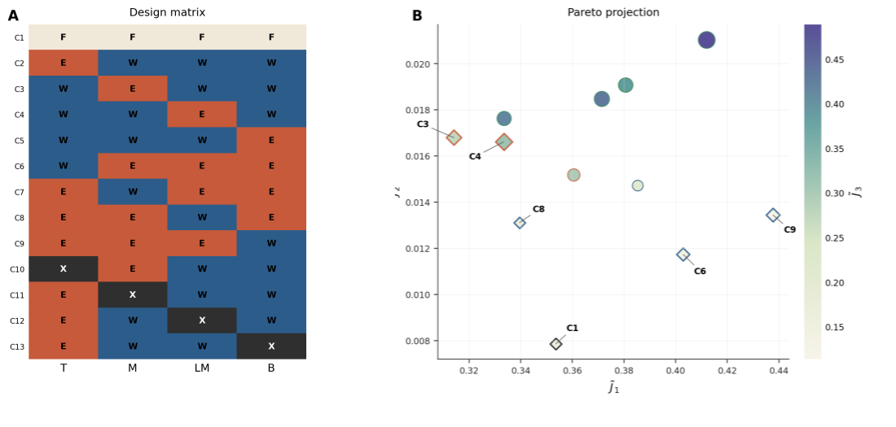
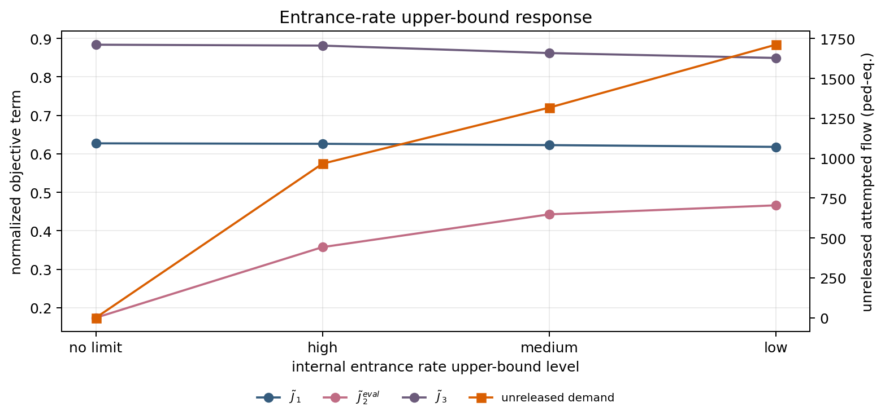
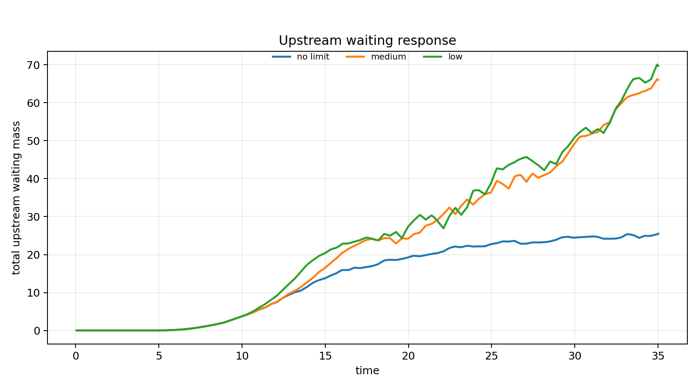

# 5 实验

本章围绕“滨水平台--多阶梯通道”场景，对本文提出的 Bellman--守恒律人群管控模型与分层约束混合变量黑箱优化方法进行验证。实验目的包括四个方面：验证方向约束与几何引导的局部行为机制，分析方向配置与内部入口通行速率控制对系统指标的影响，检验多阶段行为层对策略评价的必要性，并在统一高保真评估口径下比较本文 HCMBO 方法与典型黑箱优化基线的性能。

## 5.1 实验场景与评价设置

### 5.1.1 实验场景

实验采用简化南京东路--外滩场景。该场景抽象为由左侧来流区域、右侧观景平台及离场区域、中部隔墙和四条连通通道构成的二维区域。四条通道分别记为上通道、中通道、下中通道和下通道。通道宽度为 $2$，入口界面宽度为 $8$，网格分辨率为 $128\times96$，网格间距 $\Delta x=0.5$。每条通道的两侧入口均可施加方向规则和入口通行速率约束，超出入口放行能力的质量保留在上游等待区，从而保持质量守恒。

该简化场景保留了开放式景区中的三个关键结构：一是多通道同时承担进入、离开和回流功能；二是平台区域存在阶段性游览与离场行为；三是通道方向规则和入口限流会共同改变通道负载、局部密度和等待量。因此，该场景能够支撑模型机制验证、控制变量响应分析和优化算法对比。

### 5.1.2 数值参数与目标函数

基础仿真参数如下：自由流速度 $v_{\max}=1.5$，最大密度 $\rho_{\max}=5.0$，初始密度 $\rho_{\text{init}}=2.2$，CFL 系数为 $0.9$，安全密度阈值为 $\rho_{\text{safe}}=3.5$。机制验证与行为层验证实验使用时间上限 $140$；方向响应实验采用持续流入设置；入口通行速率优化与横向算法对比采用 $1600$ 步、时间上限 $160$ 的高保真评估设置。

评价指标包括标准化总旅行时间 $\tilde J_1$、标准化高密度暴露 $\tilde J_2$、通道实际累计通过量均衡项 $\tilde J_3$、入口等待或阻塞惩罚 $\tilde J_4$ 以及入口通行速率控制平滑性 $\tilde J_5$。综合目标函数为
$$
J(z)=\sum_{k=1}^{5}\lambda_k\tilde J_k(z)
=\tilde J_1+\tilde J_2+\tilde J_3+\tilde J_4+0.1\tilde J_5.
$$
除特别说明外，优化实验均以高保真复验后的 $J$ 作为最终排序依据。

## 5.2 模型机制验证

### 5.2.1 验证目标

本节检验方向约束 $U(x;s)$ 与固定几何引导 $M(x;\eta_0)$ 是否能够产生可解释的局部运动机制。$U(x;s)$ 用于刻画单向通行、反向通行、双向通行和通道关闭等硬规则，$M(x;\eta_0)$ 用于刻画通道轴向运动相对横向运动更有利的软几何引导。实验分别比较 baseline、仅施加 $M$、仅施加 $U$ 以及 $U+M$ 联合作用下的通道流量占比、局部方向场和流线结构。

| 机制命题 | 对比设置 | 主要观测量 | 预期现象 |
|---------|----------|------------|----------|
| $M(x;\eta_0)$ 表示软几何引导 | baseline vs. $M$-only | 通道流量占比、接近流线 | 目标通道吸引域扩大，来流提前收束 |
| $U(x;s)$ 表示硬方向约束 | baseline vs. $U$-only | 受限通道流量、局部方向场 | 受限方向被排除，流量转移至可行通道 |
| $U(x;s)$ 抑制逆行与对冲 | 双向 baseline vs. 单向规则 | 逆向质量时间、对冲单元时间 | 逆向流和对冲强度下降 |
| $U+M$ 具有空间可迁移性 | 不同受控通道位置 | 主导流量通道、热点位置 | 主导流量随受控通道迁移 |

### 5.2.2 软几何引导的吸引域效应

为检验 $M(x;\eta_0)$ 对通道接近行为的影响，实验在中通道施加固定各向异性几何引导，并与 baseline 进行对比。baseline 下，上通道、中通道、下中通道和下通道的流量占比分别为 $1.64\%$、$48.78\%$、$47.92\%$ 和 $1.66\%$；施加 $M$-only 后，中通道流量占比升至 $100.00\%$。

该结果表明，固定度量张量并不直接关闭其他通道，而是通过改变允许方向内部的相对通行代价，扩大目标通道的吸引域，并诱导来流在进入通道前发生预对齐。

### 5.2.3 硬方向约束的可行路径效应

为检验 $U(x;s)$ 的硬约束作用，实验在单向来流条件下对中通道施加方向约束。与 baseline 相比，$U$-only 配置下中通道流量占比降为 $0$，对应流量被重新分配至上通道、下中通道和下通道，占比分别为 $19.25\%$、$68.76\%$ 和 $12.00\%$。

该现象说明，$U(x;s)$ 的作用是改变局部允许方向集合，而不是连续地调整路径偏好。双向来流实验进一步表明，单向规则能够显著抑制逆向流和对冲。

| 配置 | 中通道西向占比 | 逆向/对冲质量时间 | 对冲单元时间 |
|------|----------------|------------------|--------------|
| 双向 baseline | $73.18\%$ | $415.75$ | $1213.76$ |
| 中通道东向规则 | $0$ | $0$ | $0$ |

### 5.2.4 联合机制的空间可迁移性

为检验 $U+M$ 组合对受控通道位置的敏感性，实验将受控通道分别设置为上通道、中通道、下中通道和下通道。结果显示，受控通道位置改变会引起主导流量通道同步迁移。

| 配置 | 主导流量通道 | 上通道流量 | 中通道流量 | 下中通道流量 | 下通道流量 |
|------|--------------|------------|------------|--------------|------------|
| baseline | 中/下中通道 | $1.64\%$ | $48.78\%$ | $47.92\%$ | $1.66\%$ |
| $M$-only-middle | 中通道 | $0$ | $100.00\%$ | $0$ | $0$ |
| $U+M$-middle | 中通道 | $0$ | $100.00\%$ | $0$ | $0$ |
| $U+M$-top | 上通道 | $100.00\%$ | $0$ | $0$ | $0$ |
| $U+M$-lower-middle | 下中通道 | $0$ | $0$ | $100.00\%$ | $0$ |
| $U+M$-bottom | 下通道 | $0$ | $0$ | $0$ | $100.00\%$ |

上述结果说明，$U(x;s)$ 与 $M(x;\eta_0)$ 分别刻画硬方向规则和软几何引导，二者组合能够稳定地改变目标通道吸引域、局部方向场和密度热点位置，可作为后续策略评价与优化搜索的下层动力学机制。

## 5.3 方向配置的系统响应

在局部机制得到验证后，本节进一步考察方向配置 $s$ 在完整多阶段场景中的系统效应。方向码按 $[T,M,LM,B]$ 排列，分别表示上通道、中通道、下中通道和下通道；$E$ 表示东向进场，$W$ 表示西向回流，$F$ 表示双向自由通行，$X$ 表示关闭。实验选取单进场通道、单回流通道、单通道关闭三类具有明确管理含义的策略族，并加入全自由 baseline，共形成 $13$ 组方向配置。

不同方向配置在效率、安全和负载均衡指标上呈现稳定但非单调的差异。以 $\tilde J=\tilde J_1+\tilde J_2+\tilde J_3$ 衡量，C8（SR-LM，方向码 EEWE）的综合目标最低，为 $0.5102$；C1（BSL）的安全暴露最低，$\tilde J_2=0.00785$；C9（SR-B）的负载均衡指标最优，$\tilde J_3=0.1138$；C3（SE-M）的效率指标最优，$\tilde J_1=0.3141$，但安全暴露和负载不均衡代价较高。

| 非支配解 | 策略族 | 方向码 | $\tilde J_1$ | $\tilde J_2$ | $\tilde J_3$ | $\tilde J$ | 主要特征 |
|---------|--------|--------|-------------|-------------|-------------|-----------|----------|
| C1 | BSL | FFFF | $0.3535$ | **$0.00785$** | $0.1531$ | $0.5145$ | 安全暴露最低 |
| C3 | SE-M | WEWW | **$0.3141$** | $0.01680$ | $0.2741$ | $0.6049$ | 效率最好但风险集中 |
| C4 | SE-LM | WWEW | $0.3335$ | $0.01662$ | $0.3131$ | $0.6632$ | 效率较好但负载不均 |
| C6 | SR-T | WEEE | $0.4029$ | $0.01174$ | $0.1335$ | $0.5482$ | 离场量较高 |
| C8 | SR-LM | EEWE | $0.3395$ | $0.01311$ | $0.1576$ | **$0.5102$** | 综合目标最低 |
| C9 | SR-B | EEEW | $0.4377$ | $0.01344$ | **$0.1138$** | $0.5649$ | 负载最均衡 |

结果表明，方向配置 $s$ 并不存在单调改进规律，也不存在一个配置同时在效率、安全和负载均衡上占优。方向状态的离散组合性和多目标权衡共同构成了后续自动优化的必要性。

## 5.4 内部入口通行速率控制的响应特性

### 5.4.1 通行速率上限策略设计

仅改变方向配置无法表达通道允许通行但入口需要限流的管控情形。为检验内部入口通行速率变量 $q$ 是否具有实际控制作用，本节在固定方向配置
$$
[T,M,LM,B]=[F,E,W,F]
$$
的条件下构造人工通行速率上限策略矩阵，观察 $\tilde J_1$、$\tilde J_2$、$\tilde J_3$ 与入口等待指标的变化。这里的速率上限作用于通道内部入口界面的穿越通量，不改变外部边界入流；当自由运动产生的企图通量超过上限时，仿真只缩小该入口界面的实际穿越通量，未放行部分由于守恒更新保留在入口上游，并通过等待质量进行诊断。本文将入口绑定时间比例定义为速率上限实际起约束作用的时间步占比，即企图通量大于允许通行速率并产生未放行企图通量的时间步数占总时间步数的比例。策略矩阵包括无速率上限参考以及 high/medium/low 三种上限强度。该实验用于说明入口通行速率变量的可优化性，不用于最终算法排名。

### 5.4.2 速率上限强度扫描

速率上限强度扫描显示，入口放行能力收紧会引起目标函数分项和入口等待状态的系统变化。无速率上限参考下未放行企图通量为 $0$，综合目标为 $1.6851$；high、medium 和 low 三种上限水平下，未放行企图通量分别升至 $241.40$、$329.26$ 和 $427.89$，入口绑定时间比例分别为 $0.605$、$0.666$ 和 $0.721$。同时，安全项 $\tilde J_2^{eval}$ 从 $0.174$ 增至 $0.358$、$0.443$ 和 $0.466$。

| 策略 | $\tilde J_1$ | $\tilde J_2^{eval}$ | $\tilde J_3$ | 综合目标 | 未放行企图通量 | 绑定时间比例 |
|------|-------------:|--------------------:|-------------:|---------:|----------------:|---------:|
| no-limit | $0.6274$ | $0.174$ | $0.8838$ | $1.6851$ | $0.00$ | $0.000$ |
| high | $0.6262$ | $0.358$ | $0.8814$ | $1.8652$ | $241.40$ | $0.605$ |
| medium | $0.6228$ | $0.443$ | $0.8620$ | $1.9276$ | $329.26$ | $0.666$ |
| low | $0.6181$ | $0.466$ | $0.8493$ | $1.9337$ | $427.89$ | $0.721$ |

该结果体现出明显的权衡关系：入口通行速率上限收紧会略微降低 $\tilde J_1$ 与 $\tilde J_3$，但会提高安全暴露评价、未放行企图通量和等待峰值。因此，入口通行速率上限不能简单设定为越大越好或越小越安全，而需要与方向配置共同优化。

### 5.4.3 速率变量的可优化性

从上限强度扫描看，$\tilde J_1$、$\tilde J_2^{eval}$、$\tilde J_3$、入口等待惩罚和未放行企图通量均发生可观测变化。无速率上限参考下未放行企图通量为 $0$，而 low 上限下升至 $427.89$；对应等待质量时间序列也显示，限流强度越高，入口上游等待质量增长越明显。其中 $\tilde J_2$ 采用 soft safety risk 口径，并通过 $j2\_scale=0.001$ 标定为 $\tilde J_2^{eval}$，使其与效率和负载均衡指标处于可共同驱动优化的量级。

无速率上限参考还显示，自然入口需求主要集中在 middle-plus 入口，参考企图通行率约为 $4.2504$。全部速率上限策略下，密度上限削减质量占参考质量比例的最大值为 $0.5567\%$，低于 $2\%$ 的诊断阈值，表明入口限流改变了入口界面通量和目标函数，但没有以大规模质量损失为代价。该结果支持将内部入口通行速率 $q$ 与方向配置 $s$ 共同纳入后续混合变量优化。

<!-- ## 5.5 多阶段行为层的必要性

开放式景区中的人群并非一次性从入口走向出口，而是经历进场、平台游览和离场等阶段。为检验多阶段行为层是否会影响策略评价，实验比较单阶段近似、多阶段均匀偏好和多阶段异质偏好三种设定。结果表明，忽略阶段链会显著改变通道负载和平台滞留状态。

| 场景 | 上通道占比 | 中通道占比 | 下中通道占比 | 下通道占比 | 累计离场量 |
|------|-----------|-----------|-------------|-----------|-----------|
| 单阶段近似 | $29.95\%$ | $69.53\%$ | $0.51\%$ | $0$ | $137.9$ |
| 多阶段均匀偏好 | $0$ | $0.07\%$ | $60.48\%$ | $39.45\%$ | $36.0$ |
| 多阶段异质偏好 | $0$ | $0.07\%$ | $60.48\%$ | $39.45\%$ | $32.3$ |

单阶段近似将人群过度导向中通道，形成近似最短路离场结构；完整多阶段行为层则使人群在平台游览后主要从下中通道和下通道离场。

| 场景 | $\tilde J_1$ | $\tilde J_2$ | $\tilde J_3$ | Stage 1 峰值质量 | Stage 2 峰值质量 |
|------|-------------|-------------|-------------|----------------|----------------|
| 单阶段近似 | $0.3432$ | $0.000368$ | $0.4310$ | $0$ | $0$ |
| 多阶段均匀偏好 | $0.7689$ | $0.000400$ | $0.3618$ | $11.71$ | $50.68$ |
| 多阶段异质偏好 | $0.7810$ | $0.000393$ | $0.3618$ | $11.70$ | $58.71$ |

单阶段近似给出较小的 $\tilde J_1$，但该优势来自省略平台游览停留过程，并不代表真实系统效率更高。同时，其 $\tilde J_3=0.4310$，明显高于完整行为层的 $0.3618$，说明最近通道集中会造成负载均衡失真。因此，后续优化在固定历史偏好参数 $\hat p$ 的条件下进行，重点求解可控方向配置 $s$ 与入口通行速率 $q$。 -->

## 5.5 横向优化对比

### 5.5.1 优化变量与预算

横向优化实验在固定行为偏好参数 $\hat p$ 与固定几何引导参数 $\eta_0$ 下，比较不同优化方法在同一仿真预算内搜索
$$
z=(s,q)
$$
的能力。其中 $s$ 表示四通道方向配置，$q$ 表示四个时间段的分段常数入口通行速率上限曲线。方向--速率一致性由映射 $T_s$ 自动施加，以保证单向通行、反向通行、双向通行和关闭状态下的入口通行速率约束一致。

所有优化方法均采用 $B=400$ 的候选评估预算，并对前 $10$ 个候选进行高保真复验。高保真评估采用 $1600$ 步、时间上限 $160$、Bellman 更新间隔 $5$。本文将高保真可行性定义为密度上限削减质量占参考质量的比例不超过 $2\%$。可行率指某方法在 $5$ 个随机种子中，最终高保真最优候选满足该可行性条件的比例。除单次聚焦比较外，统计结果基于 $5$ 个随机种子。

### 5.5.2 对比方法

横向对比包括一个先验基线和五类优化方法。先验基线不进行搜索，用于表示人工或历史配置的参考水平。random search 表示无结构随机采样。pure SA 表示在混合变量空间上直接进行模拟退火。enum-DE 先枚举方向配置，再用差分进化优化速率曲线。TPE-Mixed BO 表示基于 TPE 的通用混合变量贝叶斯优化。本文 HCMBO 使用方向--速率层次结构，将预算集中于方向内结构化速率搜索，并以高保真复验结果确定最终候选。

| 方法 | 搜索特点 | 作用 |
|------|----------|------|
| 先验基线 | 不进行新搜索 | 给出人工配置参考水平 |
| Random Search | 在可行空间随机采样 | 检验结构化搜索是否必要 |
| Pure Simulated Annealing | 对混合变量直接邻域搜索 | 检验通用启发式搜索能力 |
| Enumeration plus Differential Evolution | 枚举方向并优化速率曲线 | 检验“离散外层+连续内层”基线 |
| TPE-Mixed BO | TPE 混合变量贝叶斯优化 | 检验强通用黑箱优化基线 |
| HCMBO | 分层约束混合变量黑箱优化 | 检验本文结构化优化方法 |

### 5.5.3 高保真性能对比

表中给出了各方法在高保真复验口径下的统计结果。HCMBO 在五个随机种子上的平均目标为 $2.6338$，低于 TPE-Mixed BO 的 $2.7403$、模拟退火的 $2.9248$、随机搜索的 $3.0112$、枚举-差分进化的 $3.0597$ 和先验基线的 $5.4774$。同时，HCMBO 的可行率为 $100\%$，高于 TPE-Mixed BO 的 $80\%$，也高于其他启发式基线。

| 方法 | 种子数 | 平均目标 | 标准差 | 中位数 | 最好目标 | 最差目标 | 可行率 |
|------|-------:|---------:|-------:|-------:|---------:|---------:|-------:|
| HCMBO | 5 | **$2.6338$** | $0.3106$ | **$2.5065$** | **$2.4495$** | $3.1851$ | **$100\%$** |
| TPE-Mixed BO | 5 | $2.7403$ | $0.2475$ | $2.6288$ | $2.5180$ | $3.1345$ | $80\%$ |
| Pure Simulated Annealing | 5 | $2.9248$ | $0.1386$ | $2.9203$ | $2.7468$ | $3.1049$ | $60\%$ |
| Random Search | 5 | $3.0112$ | $0.1319$ | $2.9797$ | $2.8821$ | $3.2287$ | $40\%$ |
| Enumeration plus Differential Evolution | 5 | $3.0597$ | $0.1932$ | $3.1004$ | $2.7329$ | $3.2500$ | $40\%$ |
| Prior Baseline | 5 | $5.4774$ | $0.0000$ | $5.4774$ | $5.4774$ | $5.4774$ | $0\%$ |

配对比较显示，HCMBO 相对 TPE-Mixed BO 在 $4/5$ 个随机种子上取得更低目标，平均目标差为 $-0.1066$；相对随机搜索在 $5/5$ 个随机种子上取得更低目标，平均目标差为 $-0.3774$；相对 pure SA 和 enum-DE 分别在 $4/5$ 个随机种子上取得更低目标，平均目标差分别为 $-0.2910$ 和 $-0.4259$。

在代表性随机种子上的进一步比较中，HCMBO 的 best HF objective 为 $2.4495$，低于 TPE-Mixed BO 的 $2.5180$，且 $J_2$ 与未放行企图通量也更低。queue-aware LCB 变体将未放行企图通量降至 $2412.404$，但综合目标升至 $2.6162$，说明入口排队信息能够改善入口压力，却会在默认权重下牺牲一部分综合目标。

| 方法 | best HF objective | 可行率 | $J_2$ | 未放行企图通量 |
|------|------------------:|-------:|------:|----------------:|
| HCMBO | **$2.4495$** | $100\%$ | **$1.6759$** | $2545.508$ |
| TPE-Mixed BO | $2.5180$ | $100\%$ | $1.6948$ | $2815.208$ |
| HCMBO queue-aware | $2.6162$ | $100\%$ | $1.8521$ | **$2412.404$** |

上述结果支持两个结论。第一，在相同高保真评估口径和有限仿真预算下，HCMBO 的平均目标、最好目标、中位数和可行率均优于所选基线。第二，TPE-Mixed BO 是当前最强通用黑箱优化基线，HCMBO 的优势并非来自弱基线设置，而是来自对方向--速率层次结构的利用。需要指出的是，HCMBO 在个别随机种子下目标值升至 $3.1851$，主要由较高的 $\tilde J_2=2.6534$ 驱动，说明其安全暴露控制仍存在稳定性改进空间。

### 5.5.4 可视化分析

图 11--图 14 分别从多种子最好目标分布、目标--可行率权衡、有限预算收敛过程和入口通行速率剖面四个角度展示横向结果。图中 HCMBO 使用改进后的最终版本；TPE-Mixed BO、random search、pure SA、enum-DE 和先验基线作为跨实验基线。所有图件均由既有实验结果重绘，不额外运行仿真实验。

图 11 比较各方法在 $5$ 个随机种子下得到的最好高保真目标分布。最终 HCMBO 的平均最好目标为 $2.6338$，低于 TPE-Mixed BO 的 $2.7403$，也低于 random search、pure SA 和 enum-DE。图中的最小--最大范围和中位数短线显示，HCMBO 的优势不是单个偶然种子造成的；其最好值和中位数均位于较低目标区间。该图支持的结论是：在相同候选评估预算和高保真复验口径下，改进后的 HCMBO 在多种子统计上取得了最低平均目标。

图 12 将平均最好高保真目标与可行率放在同一坐标中。HCMBO 位于目标较低且可行率最高的位置，平均目标为 $2.6338$，可行率为 $100\%$；TPE-Mixed BO 位于次优区域，平均目标为 $2.7403$，可行率为 $80\%$。random search、pure SA 和 enum-DE 的平均目标均高于 $2.9$，且可行率不超过 $60\%$；先验基线目标为 $5.4774$ 且可行率为 $0\%$。该图说明，HCMBO 的优势不是通过牺牲可行性换取较低目标得到的，而是同时改善了目标值和可行候选出现的稳定性。

图 13 给出相同 $400$ 次候选评估预算下的 best-so-far 收敛过程，并通过末端放大窗展示后期曲线差异。TPE-Mixed BO 在早期下降较快，说明通用混合变量 BO 能够较早发现可用候选；random search 和 pure SA 在早期快速下降后改进有限；enum-DE 进入较低目标区间较慢。最终 HCMBO 在前期下降较为平缓，但在中后期继续改进，并在预算末端进入最低目标区间。该图对应的结论是：HCMBO 的优势来自对方向--速率结构的持续筛选能力，而不仅是最终高保真复验阶段的偶然选择。

图 14 展示 random search、pure SA、enum-DE、TPE-Mixed BO 和 HCMBO 的最好候选所对应的方向配置与分段入口通行速率上限。多个方法均选择 $[T,M,LM,B]=[W,E,E,W]$，说明该方向结构在当前场景下具有共同吸引力；差异主要体现在各入口和时间段的 $q$ 配置。最终 HCMBO 在 middle-plus 和 lower-middle-plus 等入口上形成更有选择性的分段释放，同时对部分反向入口保持较低速率上限。该图说明，最终性能提升并不只来自选到某一方向配置，还来自在给定方向结构下对连续入口通行速率曲线的细化优化。

## 5.6 HCMBO 消融实验

### 5.6.1 消融设计

为分析 HCMBO 内部设计的作用，本节从两个层面进行消融：一是控制变量与目标项是否必要，二是搜索机制如何影响最终性能。前者检验方向配置 $s$ 与入口通行速率 $q$ 是否需要联合优化，以及低保真硬筛选、DFO 精修和入口等待惩罚对候选质量的影响；后者检验结构化方向内速率搜索、queue-aware LCB、RF-style 约束代理、adaptive racing 和 trust-region search 的作用。

| 消融因素 | 对照含义 | 主要检验问题 |
|----------|----------|--------------|
| 方向与速率联合优化 | HCMBO vs. 只优化 $s$ 或只优化 $q$ | 控制变量是否必须联合搜索 |
| 低保真硬筛选 | hard shortlist vs. no hard shortlist | 短时低保真是否会误删长时程优良方向 |
| DFO 精修 | HCMBO vs. no DFO | 局部无导数精修是否带来额外改进 |
| 入口等待惩罚 | 默认目标 vs. no $J_4$ | 等待惩罚是否改变候选可执行性 |
| queue-aware score | 默认 LCB vs. queue-aware LCB | 入口排队信息是否改善可执行性 |
| 代理与候选策略 | RF-style、adaptive racing、trust-region | 额外搜索机制是否优于主干设计 |

### 5.6.2 控制变量与目标项消融

第一组消融结果表明，方向配置与入口通行速率必须联合优化。只固定高通行速率上限并搜索方向，best HF objective 为 $3.3751$；固定先验方向并只优化速率曲线，best HF objective 为 $3.3140$；二者均显著高于联合优化的 $2.6140$。这说明方向配置决定速率曲线的有效结构，而速率曲线又决定入口等待、安全暴露和通道负载的实际响应，二者不能简单拆分。

| 变体 | best HF objective | 可行性 | $J_1$ | $J_2$ | $J_3$ | $J_4$ | $J_5$ | 未放行企图通量 |
|------|------------------:|:------:|------:|------:|------:|------:|------:|----------------:|
| HCMBO | **$2.6140$** | True | $0.3883$ | **$1.7655$** | $0.3867$ | $0.0547$ | $0.1883$ | **$2599.638$** |
| HCMBO with LF hard shortlist | $2.9441$ | False | $0.4141$ | $1.9517$ | $0.3125$ | $0.0658$ | $0.1032$ | $3087.072$ |
| no DFO | **$2.6140$** | True | $0.3883$ | **$1.7655$** | $0.3867$ | $0.0547$ | $0.1883$ | **$2599.638$** |
| no $J_4$ | $2.6015$ | True | $0.3869$ | $1.9685$ | **$0.2285$** | $0.0609$ | $0.1768$ | $3239.295$ |
| only $s$ with high rate limit | $3.3751$ | True | $0.3623$ | $2.8614$ | $0.1002$ | **$0.0512$** | $0.0000$ | $2755.514$ |
| only $q$ with prior directions | $3.3140$ | True | **$0.3325$** | $2.6428$ | $0.2315$ | $0.0619$ | $0.4524$ | $3926.368$ |
| random search | $2.9441$ | False | $0.4141$ | $1.9517$ | $0.3125$ | $0.0658$ | $0.1032$ | $3087.072$ |

低保真硬筛选使目标值从 $2.6140$ 升至 $2.9441$，并导致最优候选不可行。其原因在于仿真初期人群尚未充分到达通道入口，短时低保真评价不能可靠反映 $160$ 秒长时程下的入口拥堵、平台滞留和通道负载分化。因此，低保真信息适合作为辅助诊断或排序依据，不适合作为直接删除方向候选的硬筛选机制。

DFO 精修在该组消融中没有改变最优候选，说明主要收益来自方向--速率结构化候选生成，而不是最后的局部微调。去除入口等待惩罚后，目标值略降至 $2.6015$，但未放行企图通量升至 $3239.295$，说明若不惩罚入口等待，优化器会倾向于通过更强限流降低部分目标项，从而损害策略可执行性。

### 5.6.3 搜索机制消融

第二组消融显示，HCMBO 的主要收益来自方向内结构化速率搜索。在 seed 23 的统一预算下，主干 HCMBO 的 best HF objective 为 $2.4495$，优于 queue-aware LCB、RF-style constrained BO、adaptive racing 及 trust-region search 等变体。该结果说明，在当前混合变量管控问题中，预算应优先用于方向--速率一致的结构化候选生成，而不是过早集中到局部区域或引入更复杂的候选重排机制。

| 变体 | best HF objective | 可行率 | $J_2$ | 未放行企图通量 | 主要含义 |
|------|------------------:|-------:|------:|----------------:|----------|
| HCMBO | **$2.4495$** | $100\%$ | **$1.6759$** | $2545.508$ | 纯结构化方向内速率搜索 |
| queue-aware LCB | $2.6162$ | $100\%$ | $1.8521$ | **$2412.404$** | 用入口排队信息修正 acquisition |
| RF-style constrained BO | $2.6162$ | $100\%$ | $1.8521$ | **$2412.404$** | 使用 RF-style 约束代理 |
| adaptive racing | $2.6561$ | $100\%$ | $1.9474$ | $3204.194$ | 分阶段集中预算到较优方向 |
| adaptive racing + queue-aware | $2.6683$ | $100\%$ | $1.7862$ | $2664.373$ | racing 与排队感知组合 |
| trust-region search | $3.0317$ | $100\%$ | $1.9224$ | $3967.226$ | 方向内局部 trust-region 搜索 |

queue-aware LCB 和 RF-style constrained BO 的综合目标均为 $2.6162$，不如主干 HCMBO，但未放行企图通量降至 $2412.404$，为该组最低。这说明入口排队信息能够把搜索引向入口压力较小的候选，但在默认综合目标权重下会牺牲一部分效率或负载均衡表现。adaptive racing 及其 queue-aware 组合均未超过主干 HCMBO，表明过早集中预算可能降低候选多样性。trust-region search 目标值较高且未放行企图通量最大，因此不适合作为当前主干搜索策略。

### 5.6.4 消融结论

消融结果说明，本文 HCMBO 的有效性主要来自三个设计。第一，控制变量应采用 $z=(s,q)$ 的联合形式，单独优化方向或入口通行速率都不足以得到较优方案。第二，短时低保真硬筛选会误删长时程优良方向，应从主流程中取消。第三，有限预算应集中用于方向--速率一致的结构化速率搜索；queue-aware、adaptive racing 和 trust-region 等扩展机制虽然提供了有价值的诊断信息，但在默认综合目标下均未超过主干 HCMBO。

因此，本文最终采用的 HCMBO 主干为“无低保真硬筛选、方向内结构化速率搜索、高保真复验排序”。queue-aware score 虽未在默认权重下取得最低综合目标，但能够降低未放行企图通量，可作为后续约束感知优化和安全可执行性改进的重要方向。

## 5.7 外滩场景的 HCMBO 管控迁移验证

前述实验主要基于标准化四通道场景展开，用于验证模型机制、控制变量响应和 HCMBO 搜索性能。为补充考察方法在更贴近真实景区结构的场景中的适用性，本文进一步构造了一个参考外滩滨水空间形态的简化抽象场景，并将 HCMBO 得到的候选管控方案直接用于该场景，用于观察既有管控方案在不同空间形态下对综合目标和通道负载分布的影响。

### 5.7.1 外滩场景与管控方案

外滩场景保持多通道连接、滨水平台停留和集中离场等关键结构，但在空间形状上参考真实外滩区域进行简化抽象。计算区域分辨率为 $512\times224$，网格间距 $\Delta x=0.125$。人群从外侧入口持续进入场景，经过中部通道到达滨水平台，并以平台中部目标区域作为主要汇聚和离场方向；入流强度放大系数为 $3.0$，对应实际入流率为 $0.24$。实验中的 `channel_1`、`channel_2`、`channel_3` 和 `channel_4` 分别对应当地管理方命名的外滩 $3$ 号、$4$ 号、$5$ 号和 $6$ 号通道。最大密度取 $\rho_{\max}=4.0$，转移平滑参数为 $\kappa=32$。有管控组和无管控组均采用 $1600$ 步、时间上限 $50$ 的同一高保真评估口径。

有管控组采用 HCMBO 优化得到的最优管控措施。该方案在统一高保真复验中的综合目标为 $0.7368$，未放行企图通量为 $2.7634$，等待质量峰值为 $0.9158$，用于表征在当前场景和权重设置下具有较好综合表现的候选管控方案。

该管控措施采用两段时间分段的入口通行速率上限，其主要参数如下表所示。该表仅用于说明有管控组的输入方案，不再展开优化过程中的工程细节。

| 实验通道 | 管理方通道编号 | 入口方向 | 第 1 时间段 | 第 2 时间段 |
|----------|----------------|----------|------------:|------------:|
| channel_1 | 外滩 3 号通道 | 正向入口 | $0.1488$ | $0.1541$ |
| channel_1 | 外滩 3 号通道 | 反向入口 | $0.0165$ | $0.0459$ |
| channel_2 | 外滩 4 号通道 | 正向入口 | $0.2000$ | $0.1047$ |
| channel_2 | 外滩 4 号通道 | 反向入口 | $0.0000$ | $0.0000$ |
| channel_3 | 外滩 5 号通道 | 正向入口 | $0.0000$ | $0.0000$ |
| channel_3 | 外滩 5 号通道 | 反向入口 | $0.0801$ | $0.2000$ |
| channel_4 | 外滩 6 号通道 | 正向入口 | $0.1137$ | $0.0824$ |
| channel_4 | 外滩 6 号通道 | 反向入口 | $0.0863$ | $0.1176$ |

### 5.7.2 有/无管控对比结果

表中给出了有管控组与无管控组在统一高保真口径下的核心指标。两组使用相同场景、路线、入流强度、密度上限和仿真时长，仅区别于是否施加 HCMBO 管控方案。

| 指标 | 有管控组 | 无管控组 |
|------|---------:|---------:|
| 综合目标 $J$ | $0.6710$ | $1.0140$ |
| $J_1$ | $0.4114$ | $0.3813$ |
| $J_2^{eval}$ | $0.0341$ | $0.0284$ |
| $J_3$ | $0.2255$ | $0.6043$ |
| 最终累计离场量 | $6.4509$ | $8.5673$ |
| 最终累计入流量 | $11.9193$ | $11.9995$ |
| 最终系统内质量 | $8.2184$ | $6.1822$ |
| 最大密度峰值 | $\approx 4.0$ | $\approx 4.0$ |
| 平均密度均值 | $0.003445$ | $0.003210$ |
| 企图通过入口通量 | $8.1555$ | $0$ |
| 实际通过入口通量 | $5.8605$ | $0$ |
| 未放行企图通量 | $2.2949$ | $0$ |

与无管控组相比，有管控组综合目标由 $1.0140$ 降至 $0.6710$，绝对下降约 $0.3430$，相对下降约 $33.8\%$。该改善主要来自通道负载均衡项 $J_3$ 的显著降低：无管控组 $J_3=0.6043$，有管控组降至 $0.2255$。这说明迁移后的管控方案能够改变通道使用结构，缓解单一通道承担过多流量的问题。

通道流量占比进一步说明了这一变化。无管控组流量高度集中于 `channel_4`，占比达到 $82.30\%$；有管控组则将主要流量重新分配至 `channel_2` 和 `channel_3`，二者合计占比约 $87.87\%$。

| 实验通道 | 管理方通道编号 | 有管控组流量占比 | 无管控组流量占比 |
|----------|----------------|----------------:|----------------:|
| channel_1 | 外滩 3 号通道 | $2.43\%$ | $0.32\%$ |
| channel_2 | 外滩 4 号通道 | $33.21\%$ | $1.35\%$ |
| channel_3 | 外滩 5 号通道 | $54.66\%$ | $16.03\%$ |
| channel_4 | 外滩 6 号通道 | $9.69\%$ | $82.30\%$ |

需要指出的是，该补充实验并不表明管控方案在所有指标上均占优。有管控组的 $J_1$ 从 $0.3813$ 升至 $0.4114$，$J_2^{eval}$ 从 $0.0284$ 升至 $0.0341$，最终累计离场量由 $8.5673$ 降至 $6.4509$，最终系统内质量由 $6.1822$ 升至 $8.2184$。因此，该方案的主要收益是降低综合目标并改善通道负载均衡，其代价是牺牲一部分离场吞吐和通行效率。相关图件给出了目标分项、通道流量占比和入口通量统计的可视化结果。

总体来看，HCMBO 最优管控措施在外滩简化抽象场景中仍能降低综合目标，并将无管控条件下集中于单一通道的流量重新分配到中部通道组。但该改善伴随入口未放行企图通量、离场吞吐下降和系统内剩余质量增加，说明后续若面向实际部署，还需要进一步引入吞吐约束、等待上限或多权重情景分析，以避免单纯追求负载均衡而造成过强限流。

## 5.8 本章小结

本章通过四通道开放式景区场景验证了本文模型、控制变量和优化方法。机制验证表明，$U(x;s)$ 能够表达单向通行、反向通行和关闭等硬方向约束，$M(x;\eta_0)$ 能够表达通道轴向几何引导，二者组合能够稳定改变主导流量通道、局部方向场和密度热点。方向响应实验说明，不同方向配置在效率、安全和负载均衡之间存在非单调权衡，单一人工方向规则难以同时优化全部目标。

入口通行速率响应实验进一步表明，$q$ 会显著改变安全暴露、负载均衡、入口等待和未放行企图通量。无速率上限、high、medium 和 low 四种水平下，未放行企图通量从 $0$ 增至 $427.89$，入口绑定时间比例从 $0$ 增至 $0.721$，$\tilde J_2^{eval}$ 从 $0.174$ 增至 $0.466$。这说明入口通行速率上限不是附属诊断量，而是会改变系统响应的连续控制变量，必须与方向配置 $s$ 共同优化。

横向优化实验表明，在相同候选评估预算、五个随机种子和统一高保真复验口径下，最终 HCMBO 取得最低平均目标 $2.6338$ 和最高可行率 $100\%$，优于 TPE-Mixed BO、随机搜索、模拟退火、枚举-差分进化和先验基线。相对 TPE-Mixed BO，HCMBO 在 $4/5$ 个随机种子上取得更低目标，平均目标差为 $-0.1066$。收敛曲线和入口通行速率剖面进一步显示，HCMBO 的优势来自对方向--速率层次结构的持续筛选和速率曲线细化，而不是弱基线或单次偶然结果。

消融实验进一步说明，HCMBO 的关键收益来自方向配置与入口通行速率的联合优化、取消短时低保真硬筛选，以及将有限预算集中用于方向内结构化速率搜索。queue-aware score 虽未在默认综合目标下超过主干 HCMBO，但能够降低未放行企图通量，说明入口排队信息可作为后续安全约束感知优化的重要方向。与此同时，个别随机种子下较高的安全暴露项表明，HCMBO 后续仍需在安全约束建模、搜索稳定性和真实客流校准方面进一步改进。
